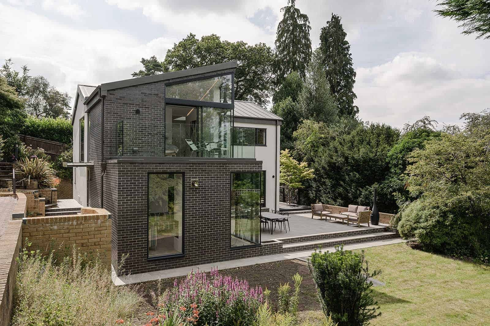
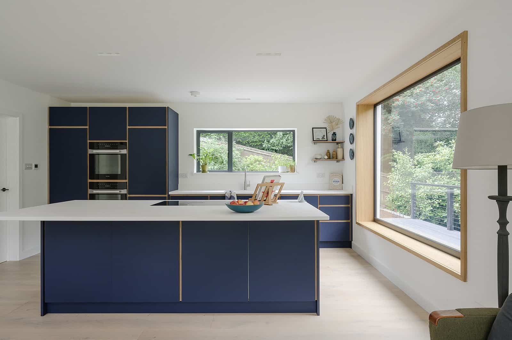
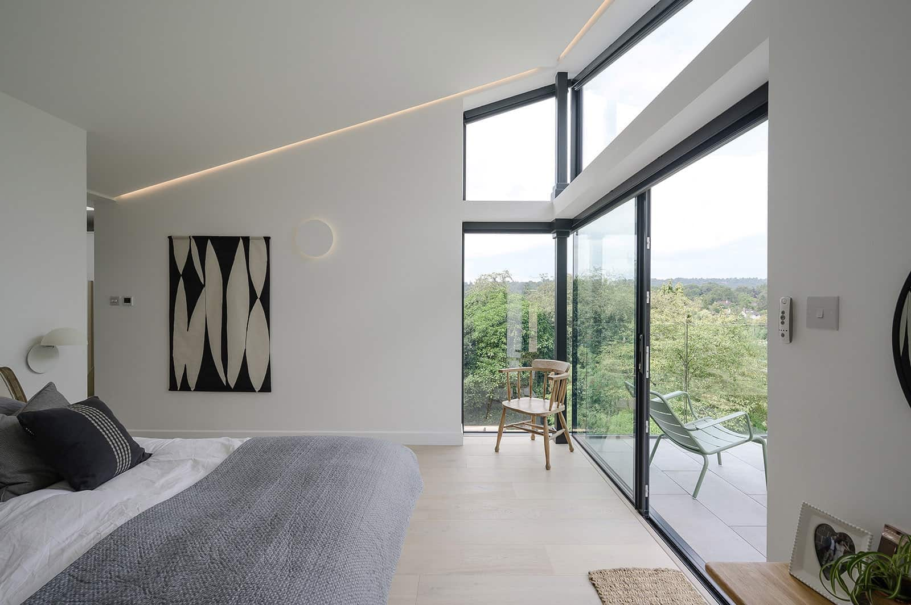
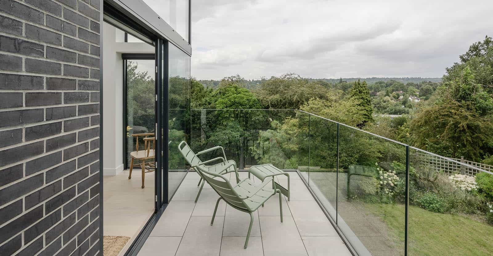

We are delighted to share our latest completed project with you. This 1960s detached house in Haslemere, Surrey, has undergone a dramatic transformation into a contemporary 5 bedroom family home.

Contractors commenced onsite prior to the first lockdown and were able to continue throughout those challenging months.

Our contemporary design re-orientated the building approach with a new, double height entrance hall, split level living room and a master-suite.

The new extension optimises the orientation with a roof terrace to take in the Surrey countryside views. The remaining existing accommodation has also been reconfigured to maximise use, access and views.

Our new lighting concept completes the holistic design transformation into a serene living and working environment for our clients.

To read more about this project, click [here](https://www.architecturelive.co.uk/projects/1960s-detached-house-haslemere-surrey/).

