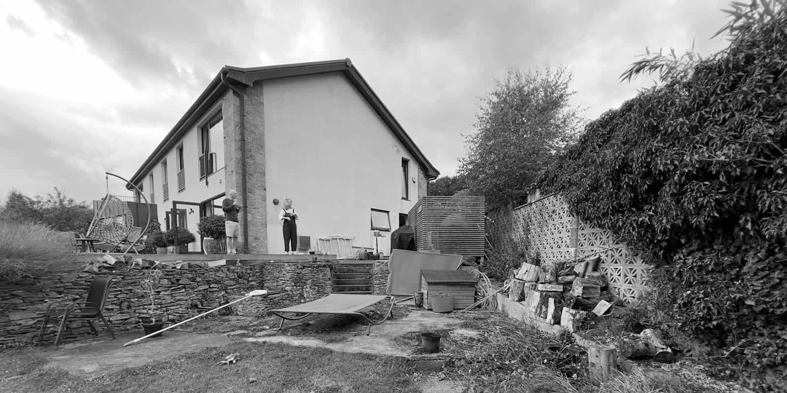
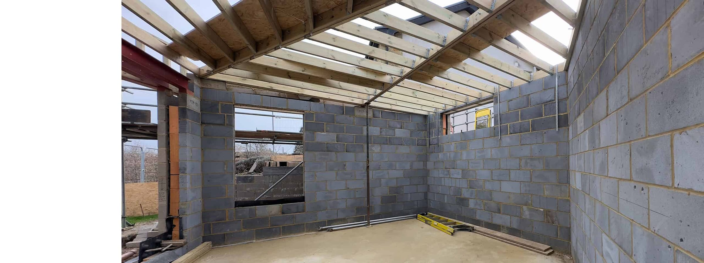
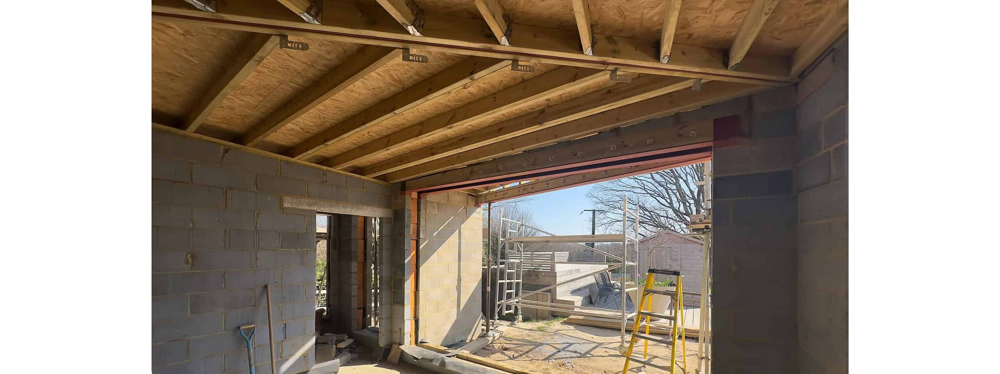
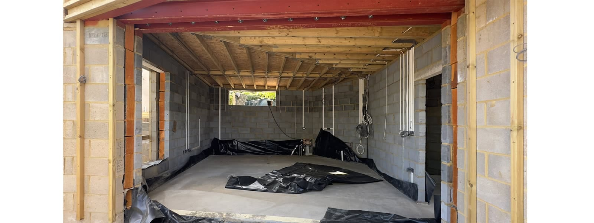
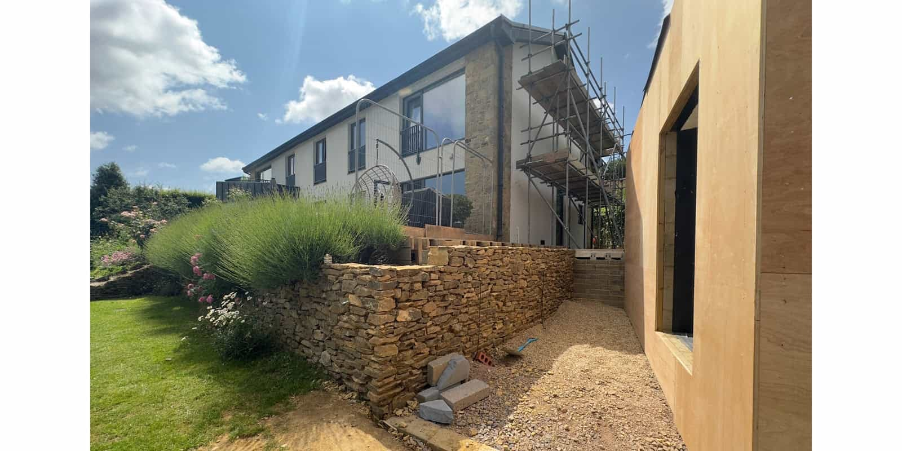
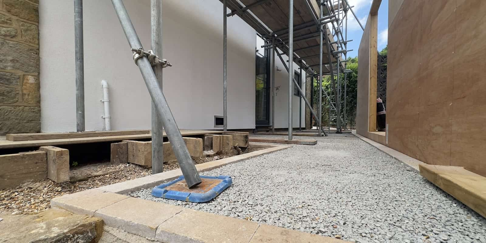
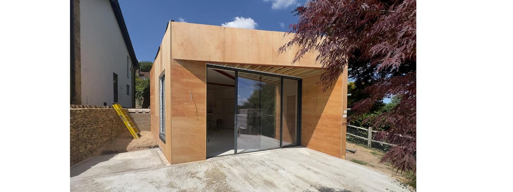
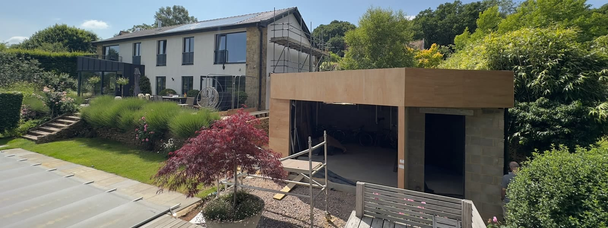

Located in a picturesque village within the South Downs National Park, [this project](https://www.architecturelive.co.uk/projects/1960s-house-lodsworth-west-sussex/) involved the complete renovation and extension of a derelict 1960s house. In 2012, we undertook the initial transformation to restore the property into a stunning family home, at the time we also gained planning permission for a Phase 2 split-level extension to optimise the leisure facilities.

Following a change of ownership, we were delighted to be invited back in 2023 to develop a new Phase 2 design. Our new clients provided a fresh set of requirements resulting in a contemporary poolside pavilion, as well as a landscape feature that reimagines a previously unloved back-of-house plant and shed area.

Applying the Lutyens-inspired concept of a garden wall defining space and forming vistas that link the house to its surroundings, a secondary approach from the driveway has now been formalised. This route leads past the boot and plant room, along the rear elevation, and finally onto the lower poolside terrace. Using materials to match the initial 21st-century extensions, the new zinc-clad garden wall adapts to the changing levels and terminates as the pavilion cladding with a canopy, sheltering a poolside outdoor seating area with views over the South Downs.

Internal updates of the main house include an enlarged new kitchen layout and the partial garage conversion into a generous utility room. These final additions implement the book-end extension concept originally envisaged in 2012, and we look forward to its completion.

