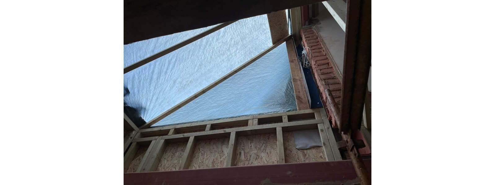
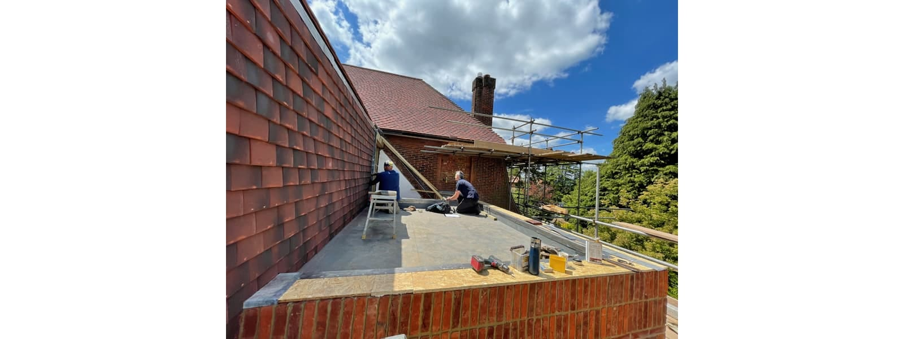
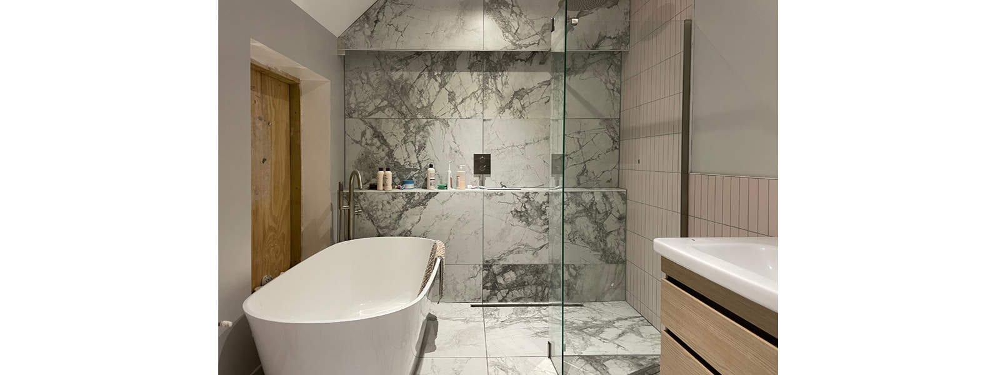

Good progress has been made at our project to extend and remodel a family home in Dorking, Surrey. A month of plastering is well underway, whilst the roof is fully re-tiled and new finishes are starting to transform the spaces.

This arts and crafts property, located in sight of the Surrey Hills, already benefitted from a good southerly orientation. However, the north elevation, looking towards the hills, only featured utility and bathroom windows and the later adaptation of a staircase window.

The Passivhaus methodology states that north-facing openings should be kept to a minimum to reduce unnecessary heat loss. However, in these unprecedented times with record summer temperatures, we argue a Mediterranean style approach is more appropriate. Whilst southerly aspects, maybe paired with a cottage garden, are still a favourite, the double aspect is therefore of growing importance. South-north facing spaces, ideally with cross ventilation, deliver the option for a seasonal change in living habits by maximising the small, but significant microclimate effects in our built environment.

For this family home, given its views, the potential was clear from the onset and the clients’ primary choice was views over sunlight. It is for that reason that the new master bedroom suite cantilevers above the new open-plan family, dining and kitchen space that features the new must-have double-aspect and cross ventilation.

Due to the near Passivhaus thermal performance of the new extensions and further improvements to the existing, the north-facing building envelope will now perform well above building regulation standards, despite its orientation. The new north-facing glazing elements, therefore, celebrate a combination of factors - the views, cross ventilation and a new seasonal approach that adds variety and richness to family living.

