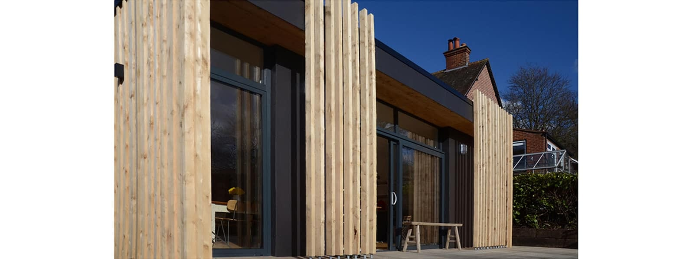

We are delighted that one of our Haslemere projects has been shortlisted for the Waverley Design Awards.

The new single storey rear and side extension to a detached, two storey property in Haslemere, will be considered for two categories -  New Buildings and the People’s Choice Award.

We will bring you further details on this competition in the New Year, including the link to vote!

Click [here](https://www.architecturelive.co.uk/projects/period-house-haslemere-surrey/) to read more about this project.

