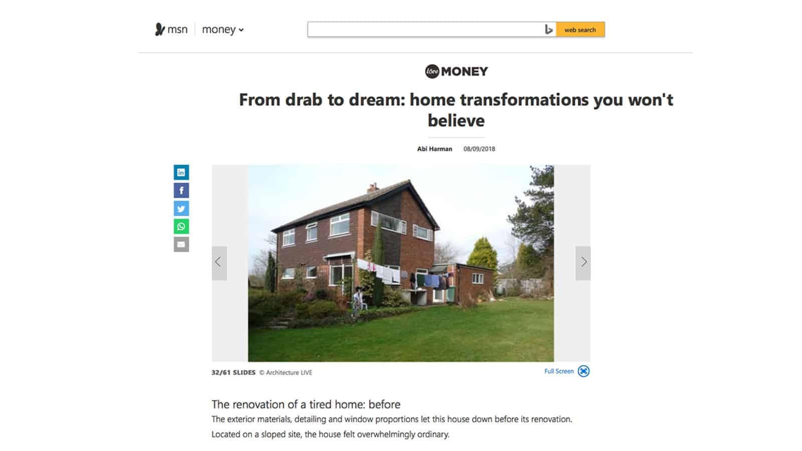
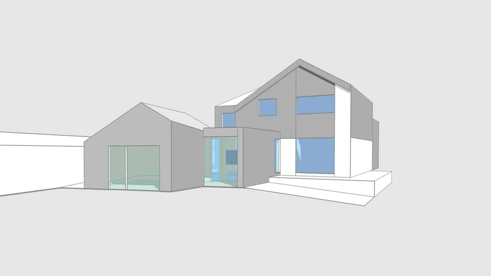

We were delighted to see one of our first projects featured in an article on msn.com as part of a collection of home transformations. 

The 1960s property in Fernhurst, West Sussex, had retained its original state until its transformation in 2009. Since then, our design provides a new partially double-height space for an open plan kitchen-diner on the ground floor and a gallery study on the first floor. A further master bedroom suite extension, located above an existing garage completes the current layout.

Double height glazing and strategically placed windows fill the property with natural daylight. Tile hanging on the exterior of the property was replaced with Western Red Cedar and stained with a black water-based stain.

Work for a further ground floor extension will commence shortly this autumn to complete our design to extend the property from a 3 to a 5 bedroom family home. 

The latest extension will provide open plan living in the form of a garden pavilion with vaulted ceilings and full height aluminium windows and timber cladding to match the existing exterior.

Take a look at the article here - [From drab to dream: home transformations you won't believe.](https://www.msn.com/en-gb/money/homes-property/from-drab-to-dream-home-transformations-you-wont-believe/ss-BBMZOyB#image=32)

