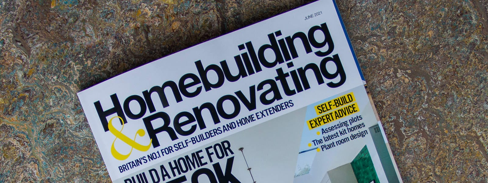
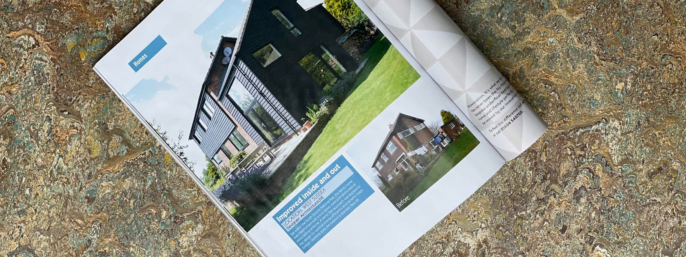

Our project, the extension of a 1960s detached home in Fernhurst, West Sussex, has been featured in the June 2021 edition of the Homebuilding & Renovating magazine - [Amazing Exterior Makeovers](https://www.architecturelive.co.uk/wp-content/uploads/2021/05/ArchitectureLIVE-Hombuilding-Renovating-magazine-article-June-21.pdf).

This is one of our earlier designs and we are delighted that it continues to inspire with its timeless appeal which we, in part, credit the black timber cladding for. We used the traditional, vernacular West Sussex timber cladding with contemporary detailing to give this property a new lease of life, replacing all concrete tile hanging and re-proportioning some fair face brickwork.

To read more about the project, click [here](https://www.architecturelive.co.uk/projects/1960s-house-fernhurst-west-sussex/).

