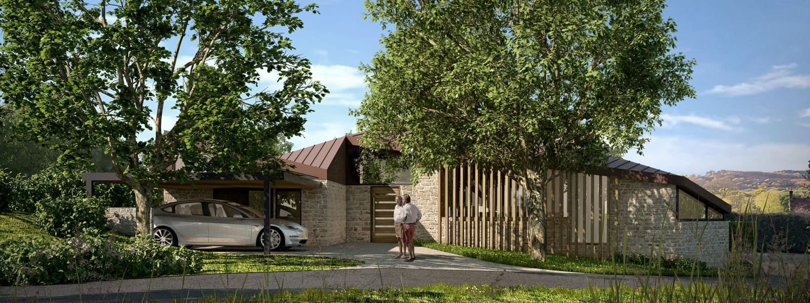
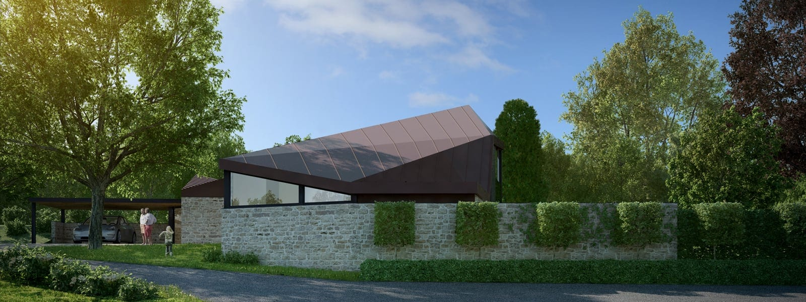
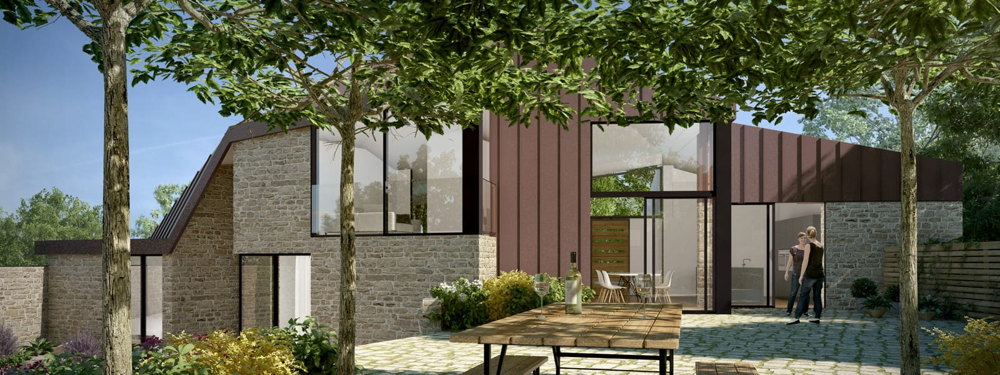
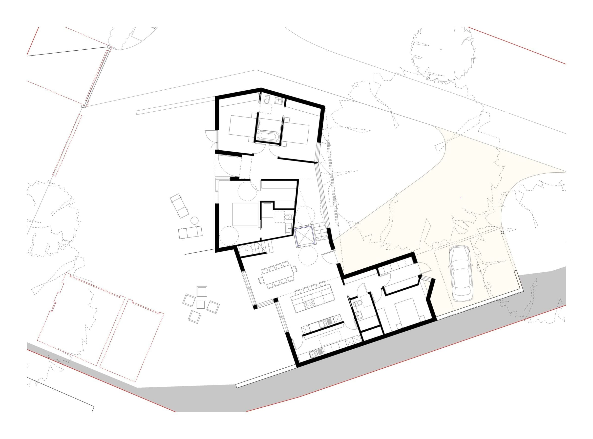
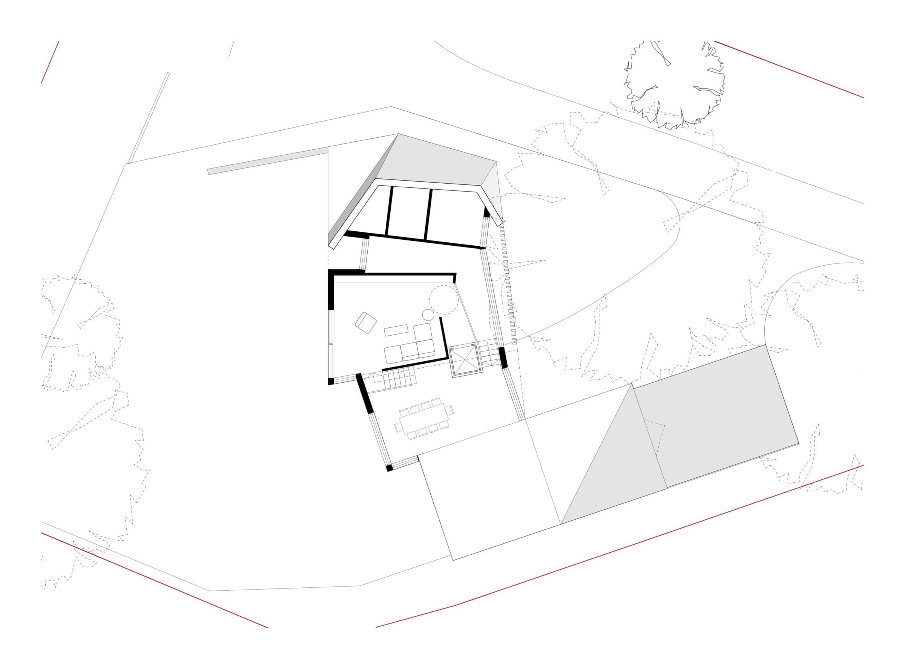
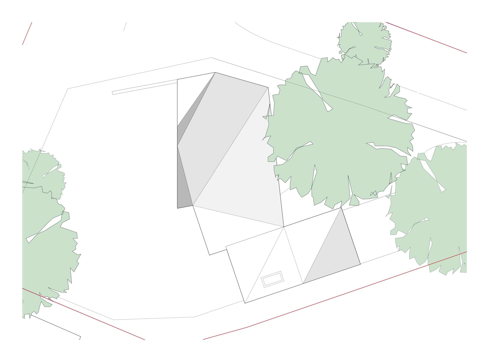

This project is our contemporary take on the chalet typology. A predominantly single storey massing approach, adopted to respond to the topography of the plot and to limit the impact on the setting. 

Located on the edge of a picturesque Surrey village, this is a brownfield site to the rear of a commercial premises. The centre of the site is home to an oak tree, surrounded by existing garages and a driveway, which also gives right of access to a number of neighbouring properties. The existing levels are falling by nearly 3 meters, from the high point behind the commercial property towards the low point along the shared drive. These existing features provide the opportunity for a split-level layout, built into the bank of the site, positioned directly behind the oak tree to enhance the setting of the new dwelling. 

This new-build low-energy design meets the principles of the [Lifetime Homes Standard](http://www.cpa.org.uk/cpa/lifetimehomes.pdf). As such, its layout is flexible to meet the changing requirements of the full lifecycle of families, including the accommodation of a live-in carer and wheelchair bound residents. Personalised features of this design include a north facing, top lit gallery space looking onto the oak tree and a crow’s nest, open-plan sitting room built into the chalet roof.

The proposed materials reflect those found locally and blend in with the setting. These are stone, in reference to many local cottages as well as an existing boundary wall and metal, present in many roofs.

Taking the form of a carport retaining wall, the new stonewall commences at the top of the site, and develops along the principle elevations of the dwelling, embracing the oak tree, until its termination as a garden-wall. In-keeping with the chalet typology, a metal skin roof folds across the entire split-level layout, resting on top of the stone wall and in areas reaching to the ground to form a private courtyard elevation.

Public views in and out of the dwelling are managed to avoid loss of privacy, with timber louvers, set behind the oak tree, to control the views from the driveway and building approach into the dwelling. In contrast, the courtyard elevation maximises the natural sunlight into the building with its south-westerly aspect and gives way to far reaching countryside views.

