One of ArchitectureLIVE’s [projects](https://www.architecturelive.co.uk/projects/1960s-house-fernhurst-west-sussex/) could now be your next home. This 1960s property remodelling and extension near Haslemere, Surrey, in the SDNP was executed as a self build and is a great case study for sustainably upgrading the existing housing stock. The original house featured uninsulated walls and roofs. Over the course of two construction phases, our design delivered high performance bookend extensions to near [Passivhaus](https://www.passivhaustrust.org.uk/what_is_passivhaus.php) standard, effectively embracing the original structure. 

A fabric first renovation formed part of the initial phase, with the existing building envelope being upgraded with double glazing through out, blown in cavity wall insulation, insulated timber cladding and loft insulation. A high efficiency [heating system](https://www.viessmann.co.uk/en/knowledge/technology-and-systems/solar-thermal-system.html) with integrated solar thermal and renewable hot water also replaced an old boiler.

Most importantly for its users though, the remodelled home provides versatile, contemporary living and work spaces, able to adapt to the changing needs of family life. All extensions feature partially vaulted ceilings to frame the views and take in natural light and cross ventilation throughout the day and across the seasons.

The first extension delivered an open-plan kitchen, dining and snug area, a master bedroom suite and a gallery study space. The second split level, multipurpose extension can be used as an annex with en-suite and independent entrance, a ground floor master bedroom suite or a games room and office, its current purpose. 

The property benefits from a wrap around garden and private driveway, which have been redesigned to maximise far reaching vistas in a private setting yet convenient village location. For further details visit [this link](https://www.hamptons.co.uk/properties/18921373/sales/A1NQ5000006UAICIAQ#/).

A note of caution, EPCs refer to the building regulation targets at the time of construction, but do not make allowances for the actual thermal performance of the specific building elements, whether higher or lower.

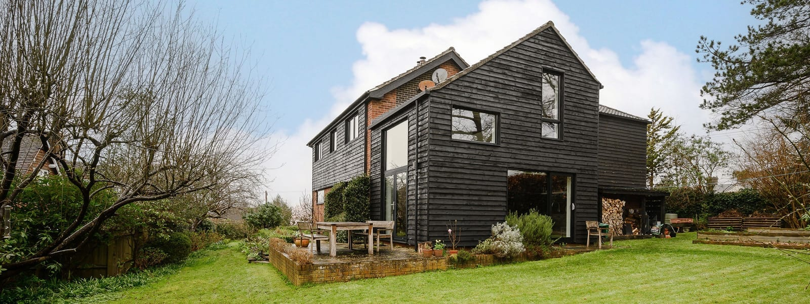

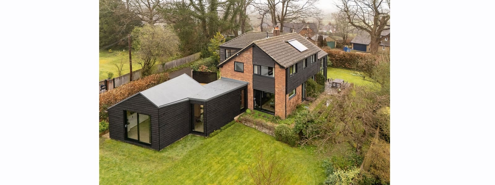

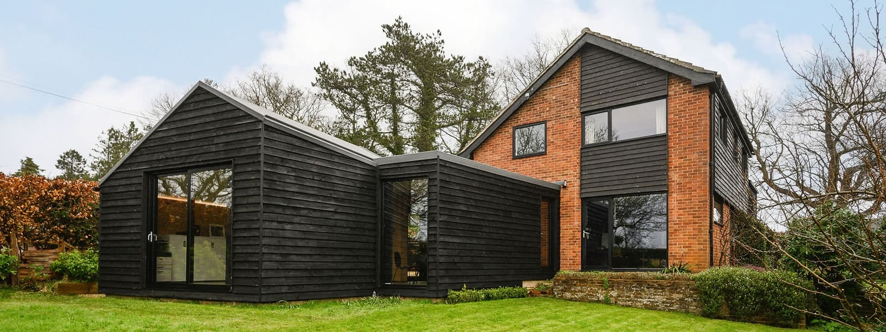

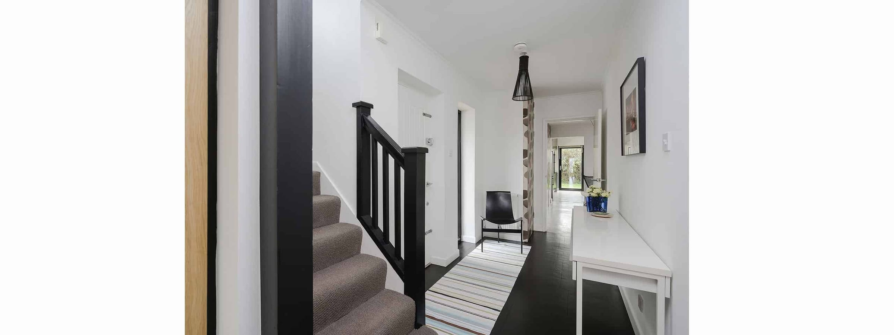

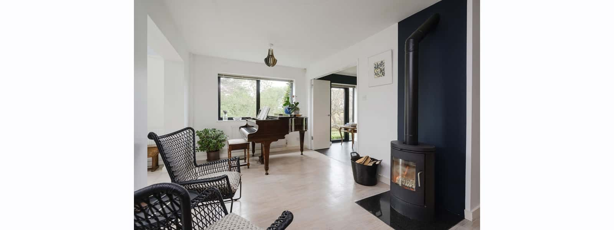

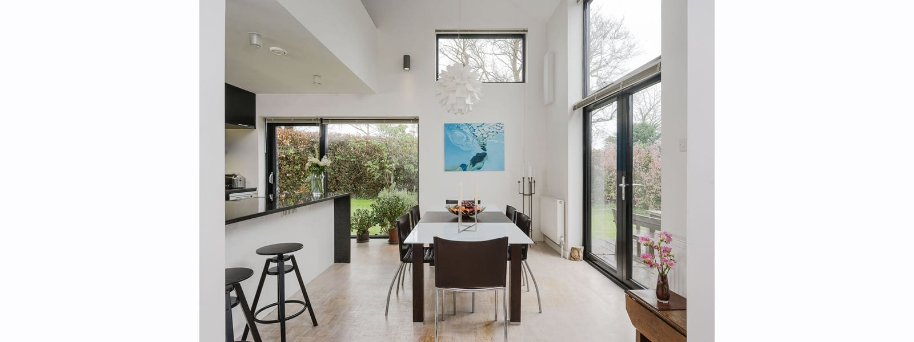

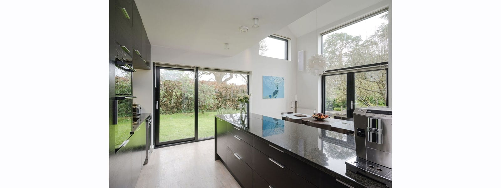

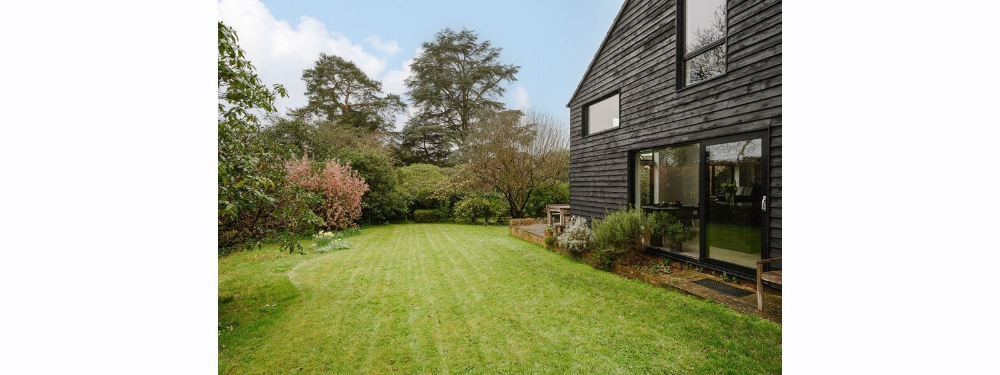

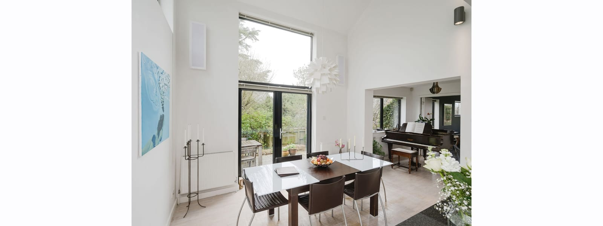

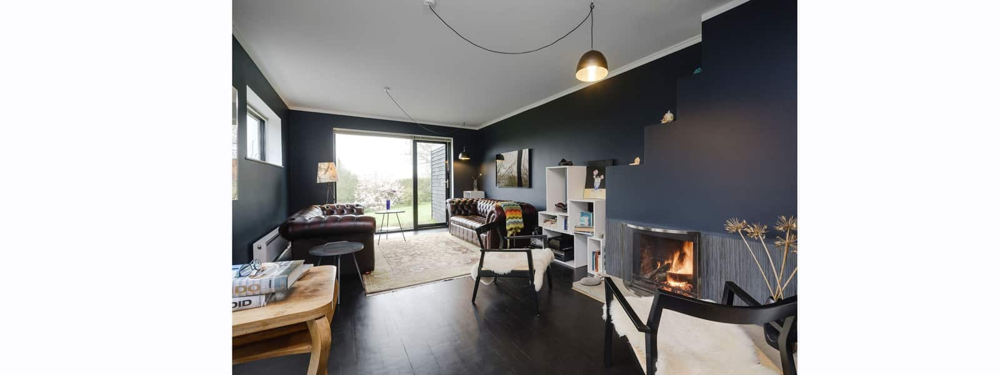

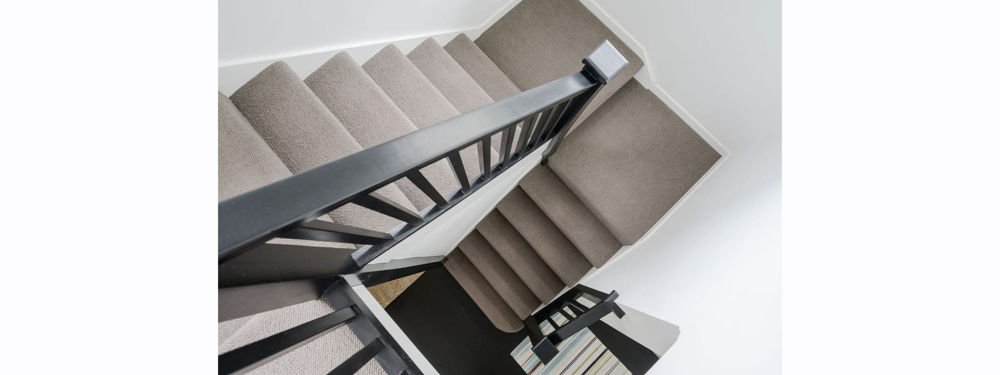

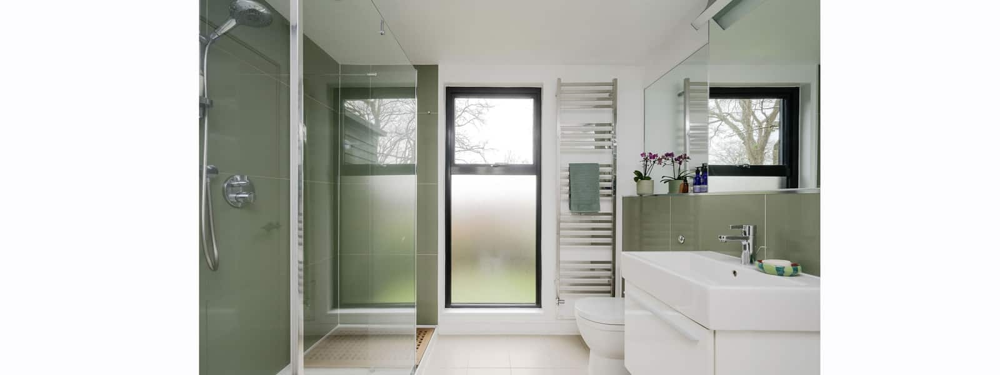

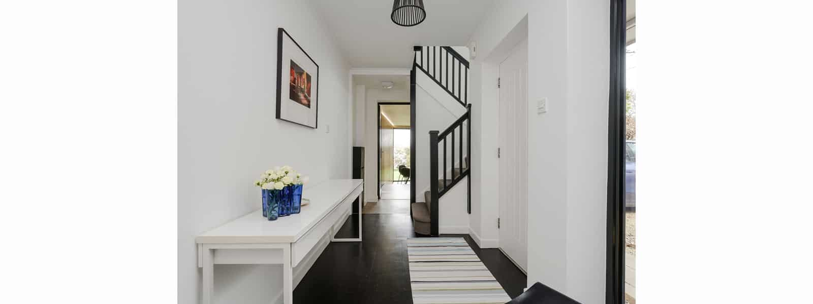

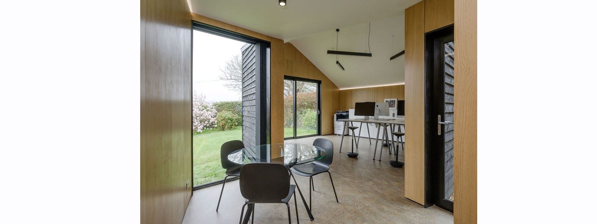

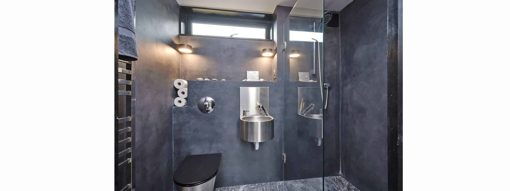

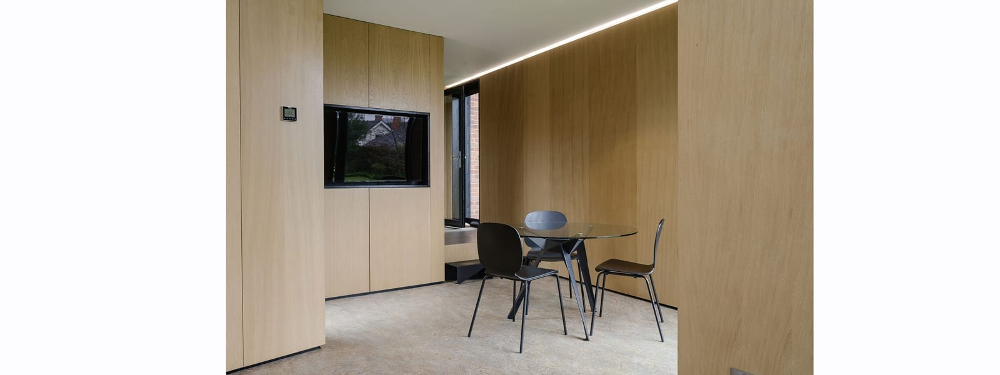
