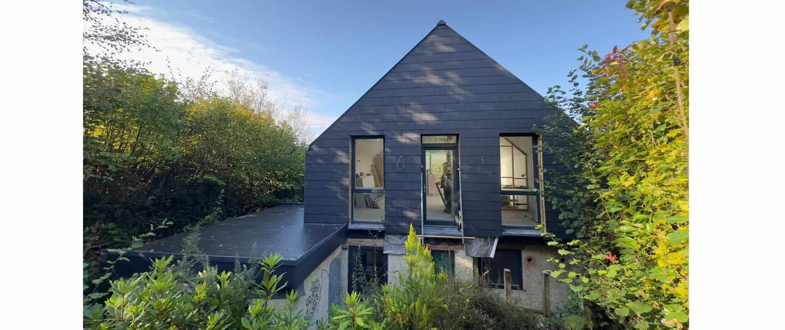
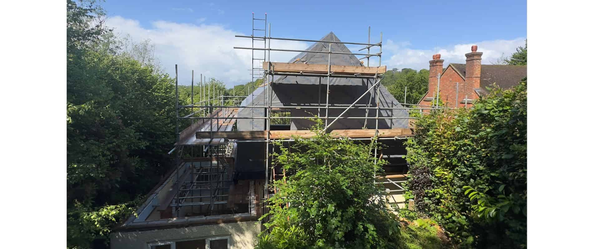
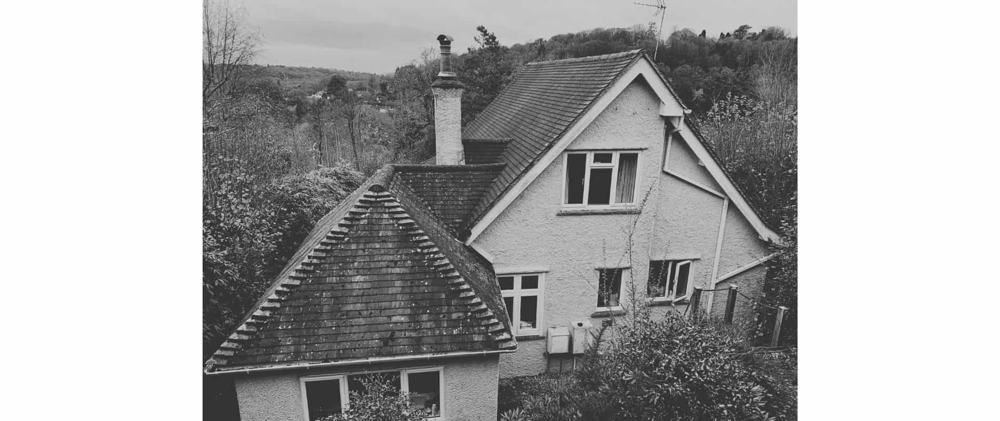
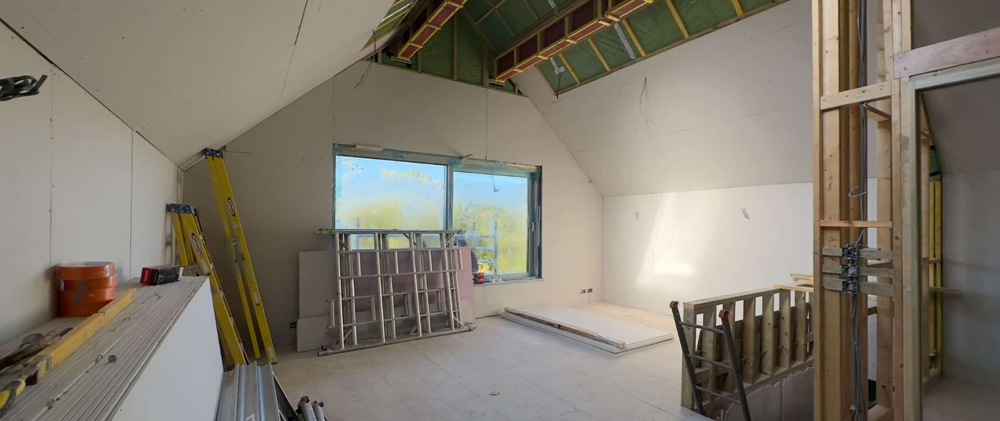
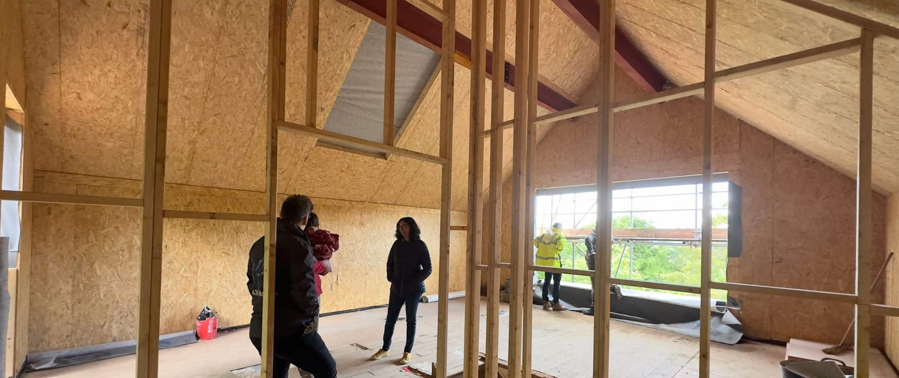
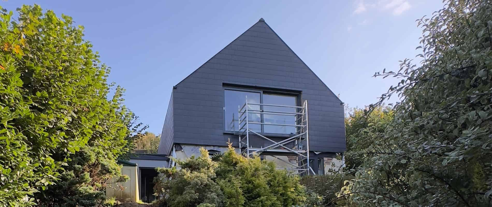
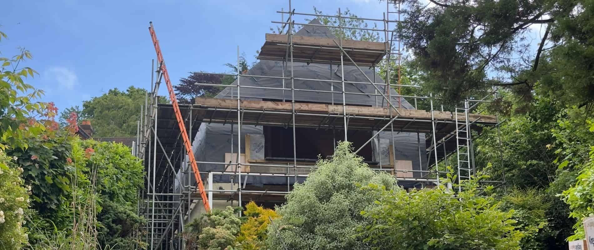
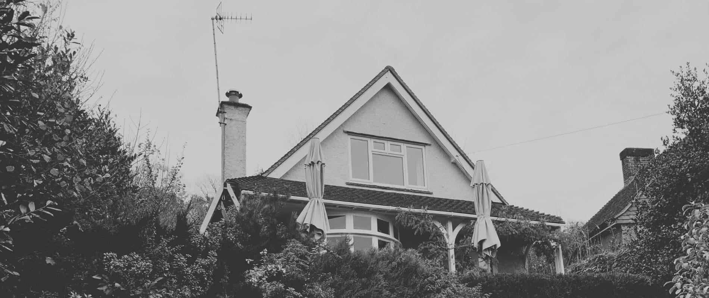
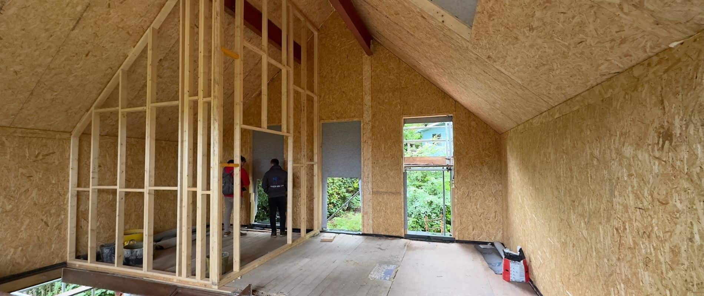
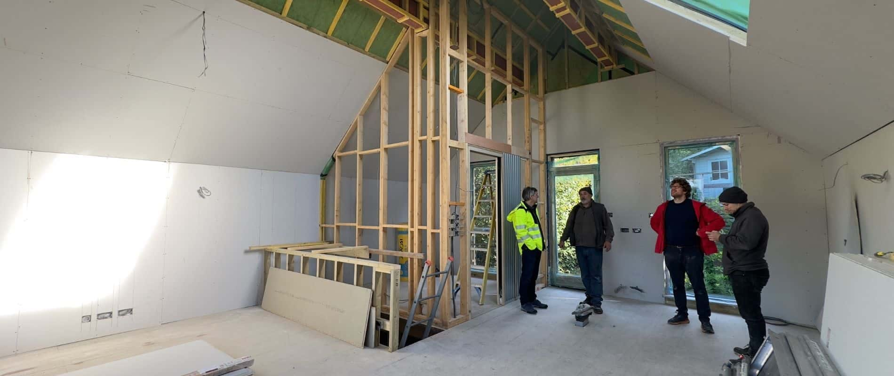

ArchitectureLIVE’s design to remodel and extend an existing 1950s chalet bungalow in Haslemere, Surrey commenced on site this spring. Applying the principles of the Passivhaus retrofit standard [EnerPHit](https://www.passivhaustrust.org.uk/competitions_and_campaigns/passivhaus-retrofit/), this project is partially completed as a self-build. All existing masonry ground floor walls will be refurbished with external wall insulation and a new render finish. A new [SIPs](https://kingspantimbersolutions.co.uk/sips/) first floor extension with an additional external insulation wrap provides the highly efficient, thermal and airtight new-build construction. 

Thanks to Haslemere’s topography, an upside down house [once again](https://www.architecturelive.co.uk/projects/1960s-bungalow-haslemere-surrey/) was the solution. Thus the new open-plan kitchen, dining and sitting room layout located on the first floor, maximises the views with cross ventilation and natural light throughout the day. New [composite triple-glazing](https://www.norrsken.co.uk/) and an ASHP in conjunction with underfloor heating complete the sustainable building credentials. 

The building works also included a new [SIPs](https://kingspantimbersolutions.co.uk/sips/) lean-to entrance and the reroofing of an existing extension to open up the views from the back garden. All new building elements are clad in artificial slate tiles, delivering an unassuming and calm exterior for the soon to be new family hub.

