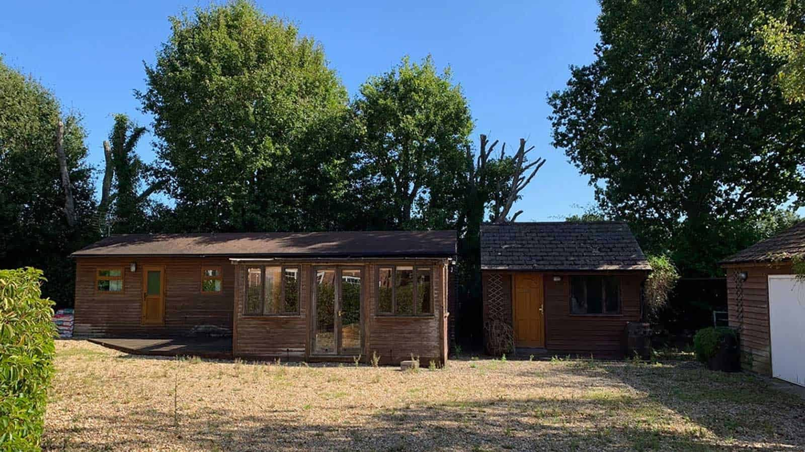

The brief was to provide accessible living accommodation to enable a close relative to live independently with the full support of family close by.

Our design replaces three existing outbuildings with a new, small, single storey dwelling with fully wheelchair-accessible accommodation in accordance with the [Lifetime Homes Standard](http://www.lifetimehomes.org.uk/pages/lifetime-homes-principles.htm).

A triple roof breaks up the massing of this new build dwelling whilst retaining the existing ridge heights and low impact on neighbours. Three distinct functions are expressed by the design. Firstly, the entrance hall, which doubles up as a multi-purpose space with kitchenette and storage. There is also access to a guest cloakroom and carer’s bedroom/study. Secondly, a central vaulted dual-aspect living and dining room that provide cross ventilation and daylight. And thirdly, the master bedroom suite, which has been designed in such a way as to provide principle framed views at bed height level with a spacious, hoist accessible, easy clean bathroom.

The design was partially inspired by the reception facilities of a sports club, replicating generous outdoor areas covered by retractable louvers providing threshold-free undercover access all year round. The material pallet partially matches the existing property and also references Georgian parapeted gables and stone surrounds.

The project will be realised with near-Passivhaus thermal performance targets, an air source heat pump, ASHP, and a mechanical ventilation system with heat recovery, MVHR.

