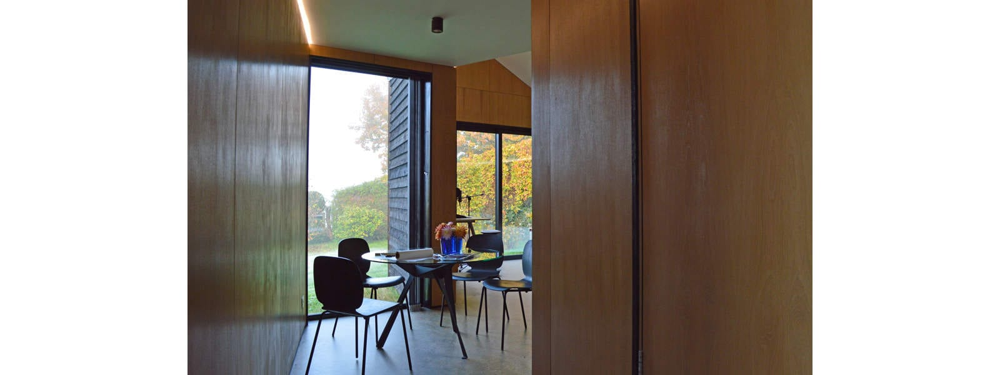

Let the magic begin.

We are delighted to commence our design for a new-build, near Passivhaus, sustainable family & retirement home. The location, a backland site, could not be more stunning with views across the rolling Surrey countryside and an existing oak tree providing ample context to reinforce our design.

Taking in our own autumnal studio views, what better way to start the day - with pen and paper to the ready. What follows next has often puzzled many. So you may also be interested to [read](https://www.antalis.co.uk/home/what-we-do/print/news-events/latest-news/2020/10/the-science-of-creativity.html?utm_campaign=UK_KF_Creative-Newsletter_Oct2020&utm_medium=email&utm_source=Eloqua) what science and psychology have discovered about the process of creativity.

In the meantime, we will do some _daydreaming_.

