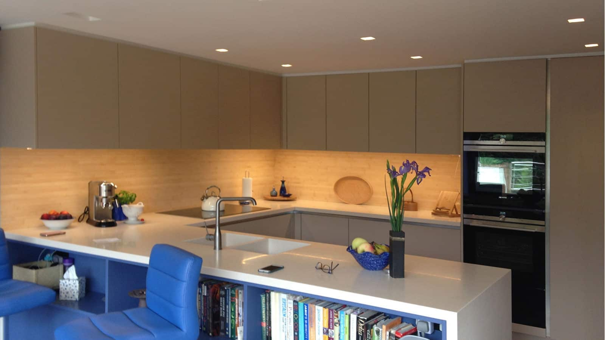
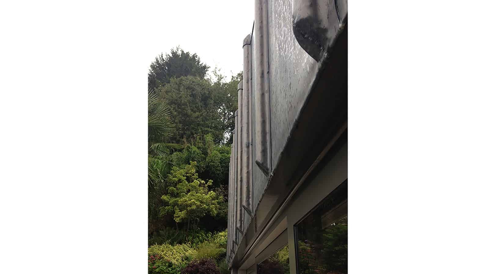

We were very excited to visit the latest of our completed projects in Rake, West Sussex, within the South Downs National Park and in an Area of Outstanding Natural Beauty.

Our brief was to extend and reconfigure an existing kitchen as a new open-plan kitchen & dining layout. The existing period cottage features typical, small leaded windows looking onto a south-westerly courtyard and hillside garden. The new extension, unashamedly contemporary, has been conceived as a single storey, mono-pitched garden pavilion with full width glazing. Views and light onto the courtyard and garden have been optimised by rotating the new facade towards the south.

The new extension also rises from the existing kitchen towards the hillside by 1.5 storeys, addressing the steeply sloping contours of the site. The new open-plan interior space therefore benefits from level courtyard access as well as high level hillside garden views framed by a picture window. The garden pavilion glazing has been complemented by a led-clad facade which combines traditi

