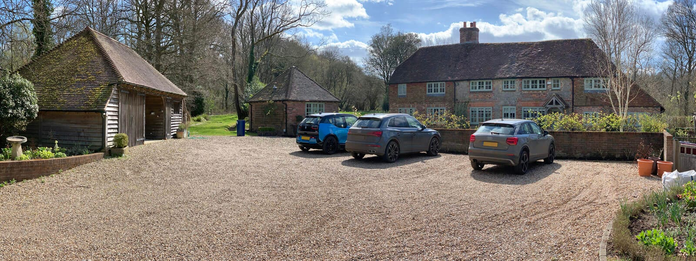

This picturesque country home originally dates back to the 18th century with extensions in the 60s, 90s and 2000s. These later additions were partly ill considered as not allowing for a clear circulation route as well as turning their back on the southerly aspect and principle views. As a result, the current layout does not suit contemporary family living, further exacerbated by the poor energy performance and state of repair of the home.

Following the adoption of Planning Policies SD30 and SD31 last spring, the development potential of affected properties no longer depends on the site area and proportionality of the proposal, but on the size of the property at the date of assessment. Despite the poor quality of its internal layout and medium size, this country home, therefore, had already reached its maximum development potential.

Consequently, our design strategy is a complete reorientation of the interior from north to south and east to west predominantly within the existing envelope to open up all principal living spaces towards the views and natural daylight. We also redesigned the circulation across the entire home, eliminating any through-room routes and formed a double height space around a new feature staircase to further open up daylight filled views across the new interior.

Energy efficiency is also at the heart of this project in order to provide a new lease of life to this historic structure. A ground source heat pump, GSHP, in conjunction with new underfloor heating throughout will provide good room comfort. The existing building envelope will be upgraded well above Building Regulation standards including new windows and doors.

Our design focusses on enhancing the original stone cottage character, whilst replacing existing low quality brickwork extensions respectfully with contemporary features and details. 

​

