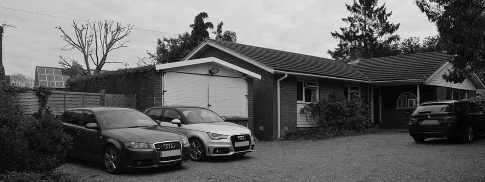
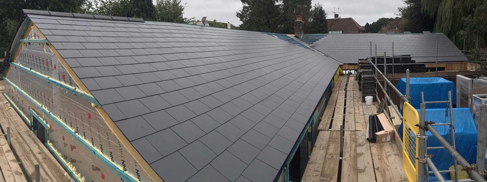

Located on the edge of Surrey Hills Area of Outstanding Natural Beauty, this prefabricated 1970s bungalow sits on a backland site, surrounded by rear gardens.

Our clients’ brief was to extend the property to optimise the layout and functionality of the living accommodation as well as improving the appearance of the building, including the approach and entrance to the property.

The demolishing of an existing garage and rear extension were followed by the construction of our design for two bookend extensions, to the west housing the master bedroom suite and, to the south a new open-plan kitchen & dining space.

The building approach has been improved in order to respond to the new parking layout and access to the property.

Externally, our design features new timber cladding and a slate roof for the entire building, thereby updating the appearance of the property and using sustainable, natural timber cladding. Existing windows have, in part, been enlarged to improve their appearance and are being replaced with dark grey polyester powder coated aluminium glazing to complete the transformation.

