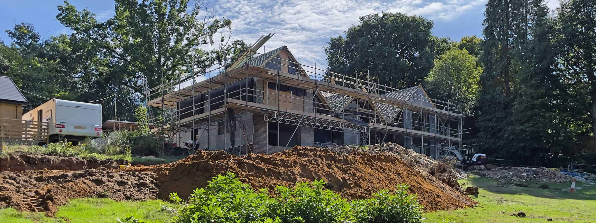
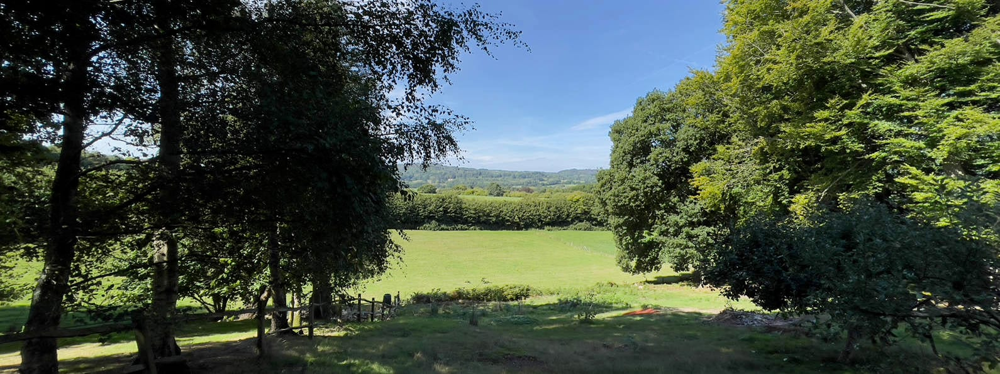
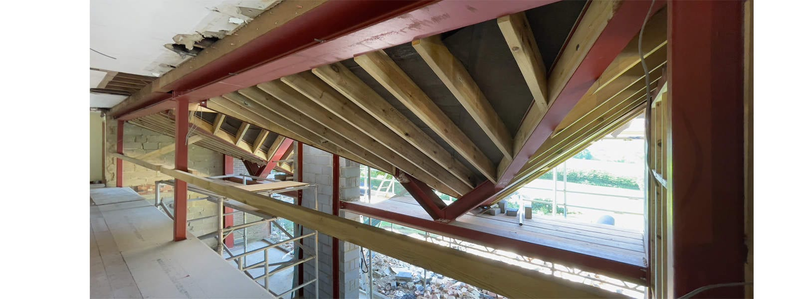
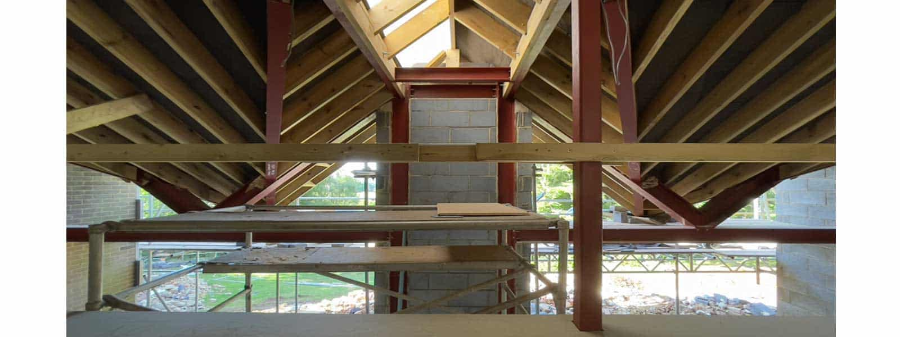
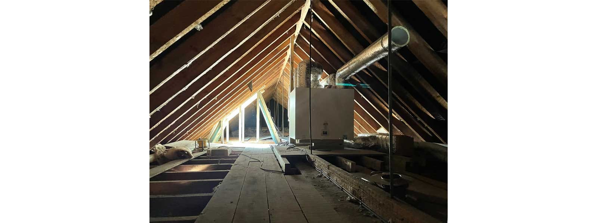
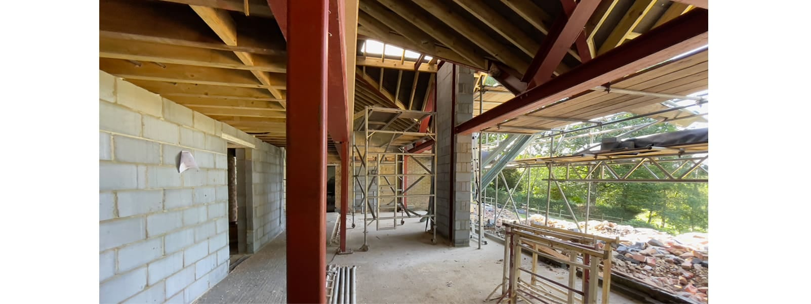
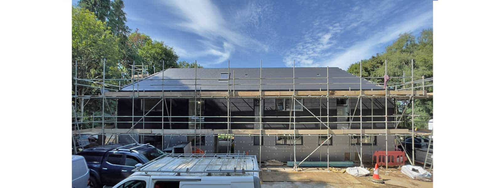
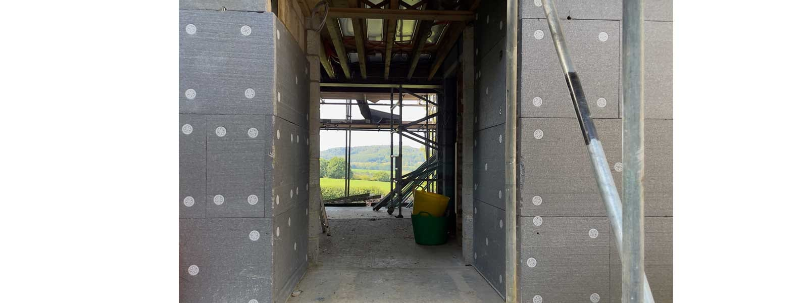

In the tailwind of Covid, this remodelling & extension project had a challenging start on site but is now making great progress. 

Located on a sloping site, the works commenced in autumn 2021. Yet difficult ground conditions soon required a redesign with further complications during the installation of the piled foundations. 

With the groundworks finally out of the way, the steel-frame to support the new atrium extension was the next challenge. A complex-geometry frame marries an existing gabled roof with a new mirrored gable extension by use of a further link-gable.

The new atrium below the link-gable will feature a near double height glazed facade. A generous roof overhang will shield the glazing in compliance with the Dark Night Skies policy and provide a cover, outdoor seating area. The interior focal point of the atrium will be a free standing stove to rival the far-reaching SDNP views on a cold winter’s day. 

Window and door openings have been remodelled to deliver a contemporary, new design and the entire building has been wrapped in insulation. A rendered system will be applied to the gable facades and ground floor. The various roofs, old and new, as well as the remaining first floor elevations are currently finished with artificial slate. 

We are delighted that our clients are proceeding with the MVHR system, which not only reduces heat-loss through ventilation, but first and foremost radically improves the air quality for this family home. The building services will be powered by an ASHP and PVs to serve the new underfloor heating throughout that will top up the minimal, additional heating required.

[Planning news](https://www.architecturelive.co.uk/2020/07/planning-granted-for-country-house-renovation-extension-in-liss-sdnp/)

