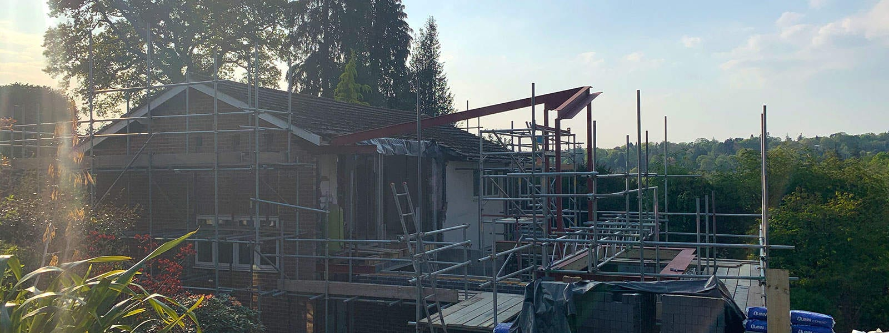

Work has restarted on our contemporary home extension to a 1960s property in Haslemere, Surrey. The steel frame and structural changes to the existing building were completed before lockdown and the work will now focus on the new masonry walls. The future views from the new first floor master bedroom suite with balcony are now visible. What a great view of Haslemere’s green backdrop!

To read more on this project click [here](https://www.architecturelive.co.uk/2019/05/planning-approved-for-contemporary-extension-in-haslemere-surrey/)​.

