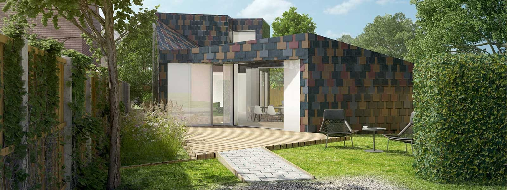
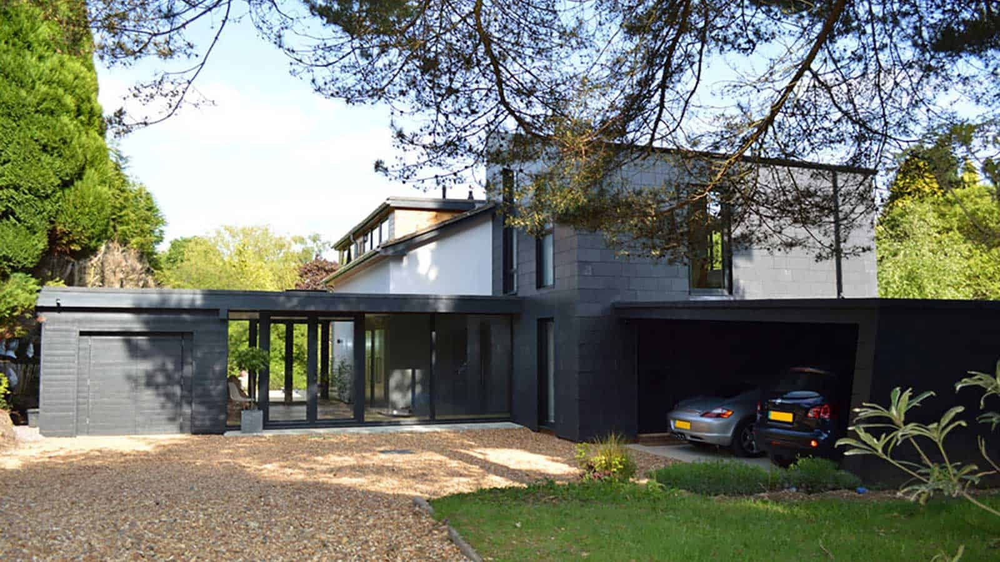
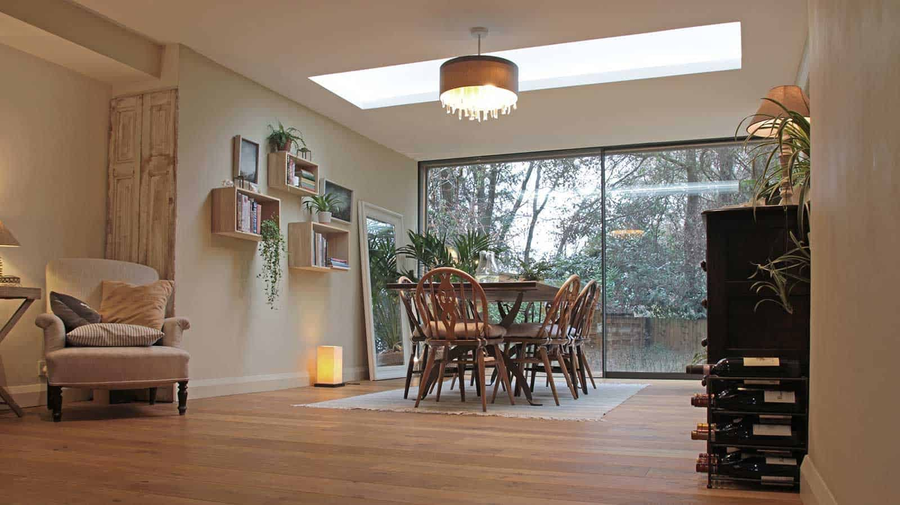
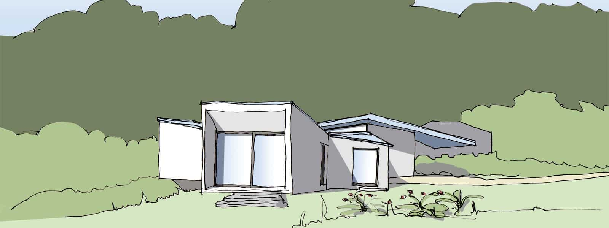
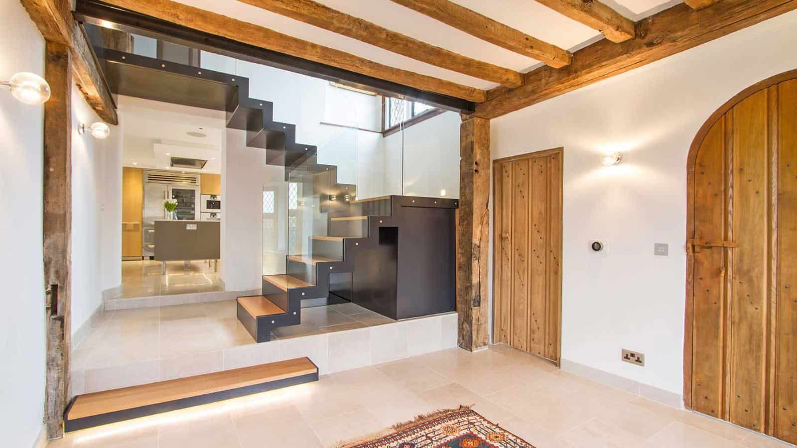
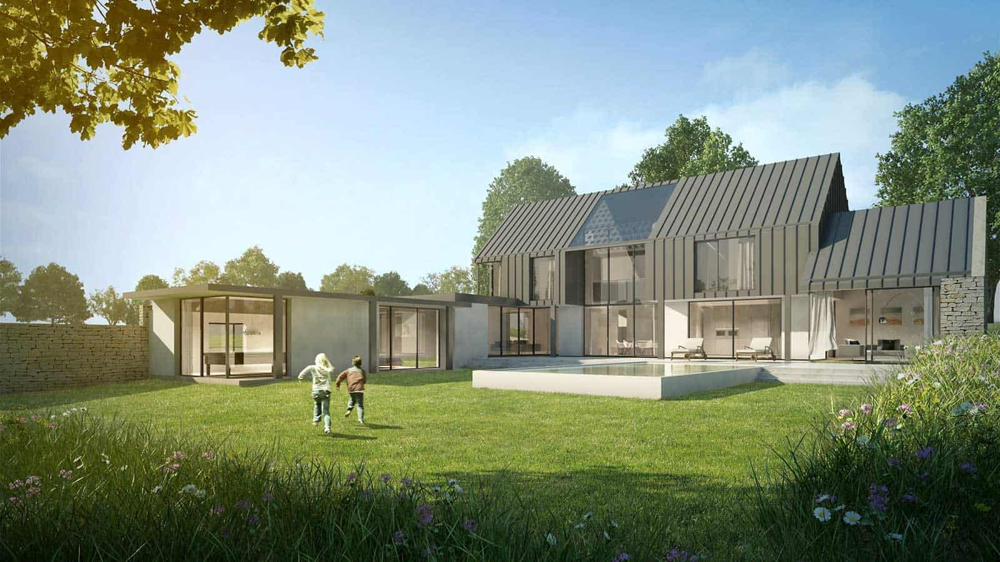

_“What we find beautiful is the promise of happiness”  - Stendhal_ 

It takes genuine understanding, passionate commitment and sheer quality of architectural design to deliver your vision and future-proof your plans. This is our offer to you, underpinned by over 20 years of experience, having worked on a variety of projects in the domestic, residential and public sectors. 

As a collaborative team of RIBA Chartered architects we combine extensive studies and training with large practice expertise and a personal touch delivered in a local design studio setup.

There appear to be three groups of consultants within the construction industry. Those who have a very good understanding of technology, others that specialise in sustainability and finally those that are most passionate about design. We take a holistic approach, ensuring that none are implemented to the detriment of the other.

The key to our success is the art of conversation. Our dialogues are the collaboration with our clients and, as the project progresses, other consultants and contractors that inform and shape our projects. We believe, well considered architecture is fundamental to the experience of every aspect of life - living, learning and working - and enhances our wellbeing. Our conversations, therefore are highly personal to fully understand your requirements in order to answer them with [our designs](https://www.architecturelive.co.uk/projects/).

We love the element of surprise which comes with the process of seeking out our clients' uniques in our design. With no preconceived design style, our inspirations instead are fed by our clients’ personalities, varied backgrounds and expertise and our desire to plan for the future. Inspired by nature and a strong sense of context, we apply a pragmatic approach to all our projects to protect our environment for future generations to come and to create environments protective of our clients.

If you would like to begin a conversation with us, please [get in touch](https://www.architecturelive.co.uk/contact/).

_Irene & Jonathan_

​

