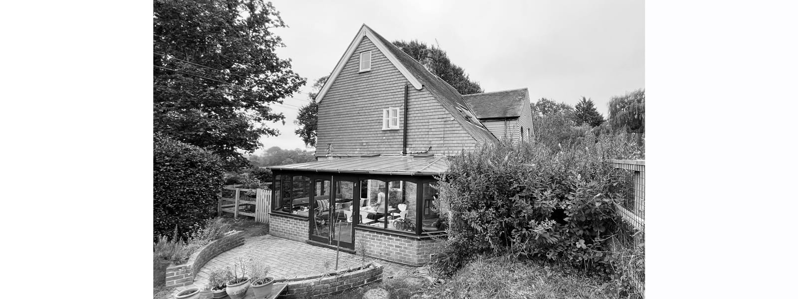
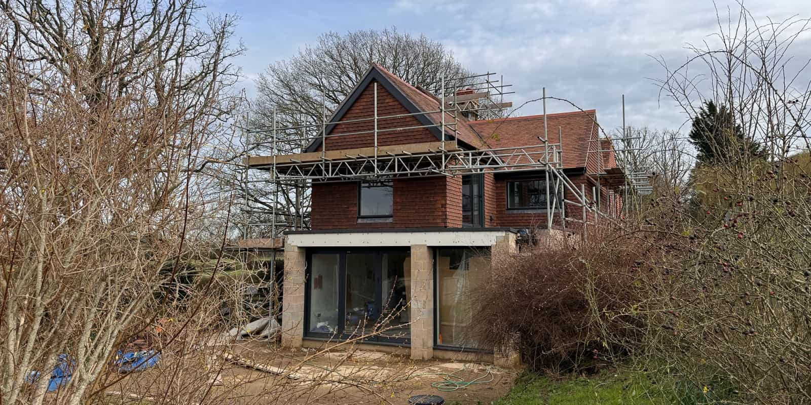
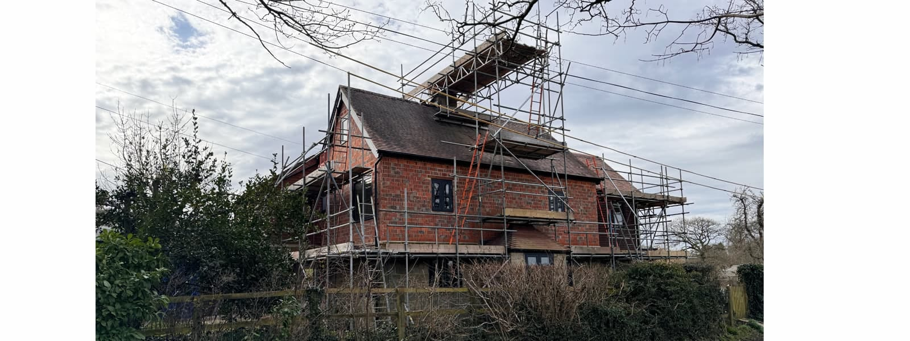
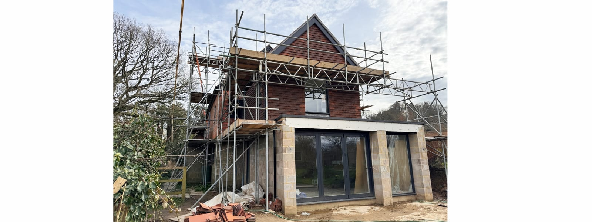
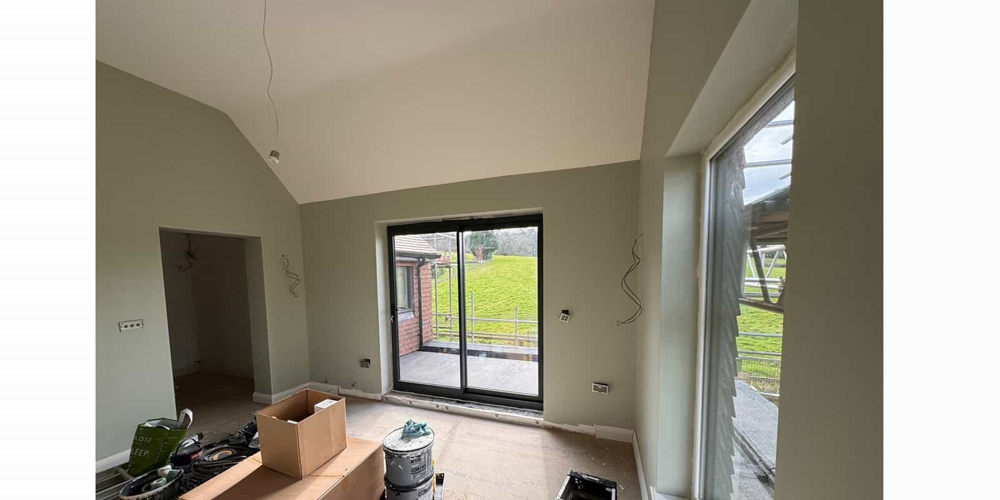

Our remodelling and renovation project of an existing 1800s cottage is nearing completion.

With planning permission granted at the end of 2022, the construction for the side and rear extensions commenced last autumn. The brief was to renovate a three storey cottage with the addition of a new open-plan kitchen, dining and family space in lieu of an existing conservatory. A new master bedroom suite with an outdoor sitting terrace, to take in the countryside setting is located above.

Due to previous extensions blocking the circulation, the existing landings and bedrooms also required remodelling to enable direct access to all principal rooms and bathrooms.

The exterior of the cottage features original stone walls on the ground floor, but was clad in unsympathetic tiles on all remaining floors. This project therefore also included the removal of the existing tile-hanging in order to reinstate the original, facing brick cottage walls on the upper floors. 

Thermal improvements to the historic building envelope include interior hemp plaster, which retains a breathable wall construction and minimises the impact on the interior layout. The new open-plan extension will be completed with a render finish, a contemporary take on the cottage stone walls. And buttress blinker walls will protect the new glazing from neighbouring views. On the first floor, the new master bedroom suite will blend in with the later extensions, set back from the original building line and finished with new sympathetic tile hanging.

