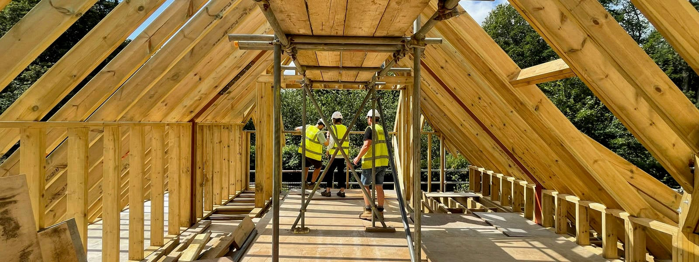
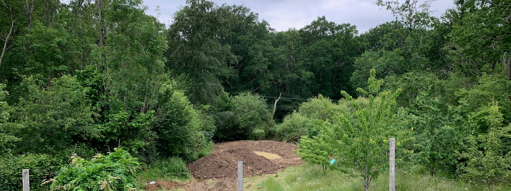

As is often the case, challenging circumstances assist to strengthen our responses. This project illustrates the point as our design solutions have become more and more contextual. The latest addition is a new semi-basement plant-room to house the new ground source heat pump which resembles the existing garden walls.

Little did we know that severe weather would further hamper progress at the beginning of the year. Due to the delayed bat licence issue, the slab construction was pushed into the winter months and a water logged site, typical of the clay-rich grounds in Lodsworth, West Sussex, then challenged the construction.

As a consequence of this, and in view of increased surface water flooding and record rainfall intensities, our brief - to make this cottage renovation future proof - further expanded to include land drainage and storm water retention with a new western-end attenuation pond.

contractor

[Brickfield Construction](http://brickfieldconstruction.co.uk/)

engineer

[Design4Structures](https://www.design4structures.com/)

link

[previous news](https://www.architecturelive.co.uk/2021/01/sdnp-country-home-lodsworth-west-sussex-construction-update/)

