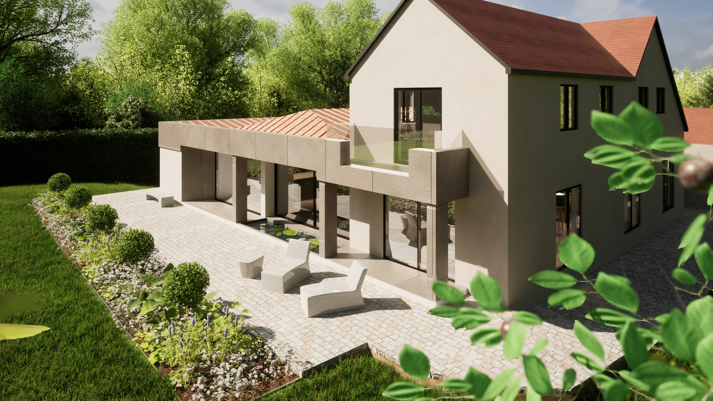

This country house is a large, two storey, detached building set in wooded grounds, dating back to the mid 1900s. Despite the extensive size of the property, this family home lacks a clear circulation route on the ground floor with circulation through rooms and the principle entrance directly leading into the kitchen. The property is also very introverted and not taking advantage of its beautiful setting. 

Our planning design, therefore provides a new, welcoming building approach and entrance hall with optimised ground floor circulation and direct accessed to all principle rooms. A proposed new side extension also provides a generous, open-plan kitchen, dining and living space that directly accesses the garden and addresses the countryside setting.

A small first floor extension and internal alterations further improve the existing sleeping accommodation and bathroom provision as well as rebalance the entrance and building approach.

Extensive energy efficiency measures and the provision of sustainable heating conclude the modernisation of this proposal.

