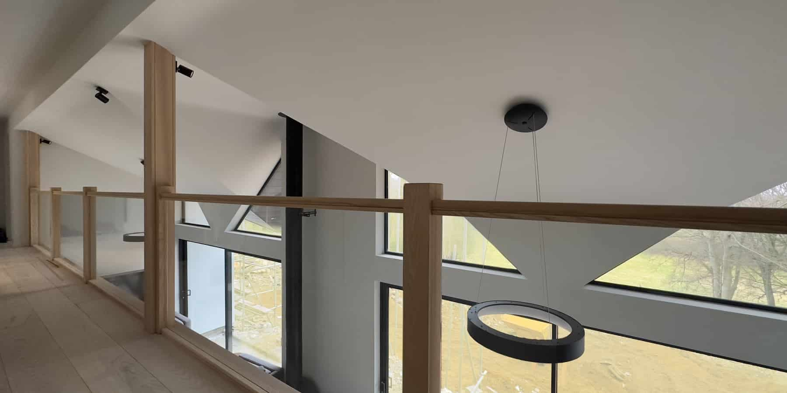
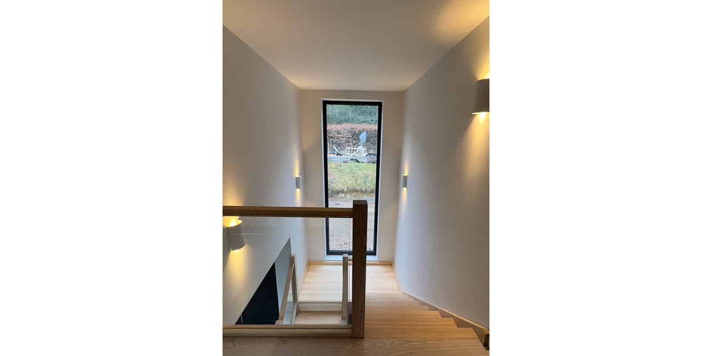
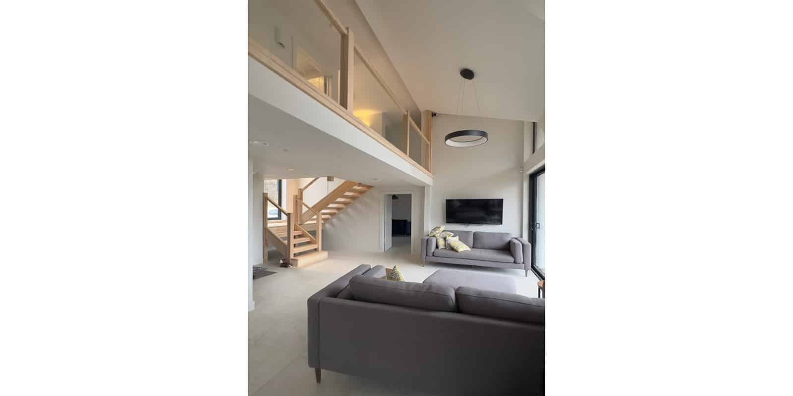
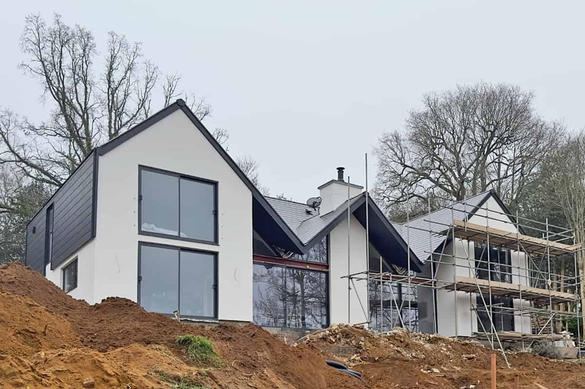
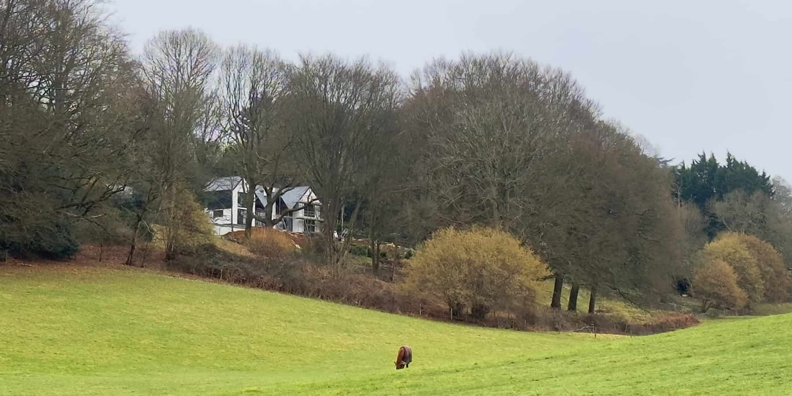

Whilst the external works are still ongoing, the country house renovation and remodelling project is now receiving its finishing touches.  

An atrium extension featuring a double height, open-plan living and dining space now flows seamlessly into a new two storey side-wing that mirrors an existing gable. This part of the house accommodates the new kitchen, pantry/utility and boot room on the ground floor and a master bedroom suite on the first floor.

The generous atrium roof will shield the near double height south-westerly glazing from the summer sun whilst opening up towards the far reaching South Downs National Park views and also provides an under cover, outdoor seating area. 

The completely remodelled exterior boasts insulated render and artificial slate tile hanging with a new entrance porch recess. The various roofs - new and old, refurbished to match the extensions now form a holistic design, and it is no longer possible to distinguish the original 60s house from its later additions.

Once completed, the large sun terrace and outdoor pool will provide a stunning backdrop for this rejuvenation project.

architect

ArchitectureLIVE

contractor

[Corner Construction](http://cornerconstruction.co.uk)

engineer

[Design4Structures](https://www.design4structures.com)

