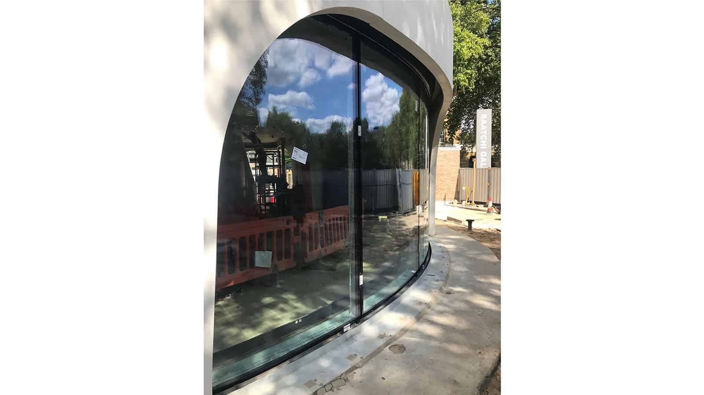
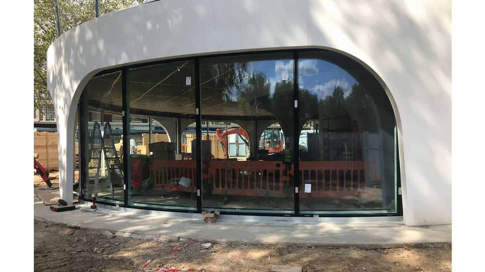

As UK agents for [Kollegger Descender Fronts](http://www.kollegger.net/), a subsidiary of [HIRT](https://hsdw.ch/en/), we were very excited to visit the team onsite at the Duke of York Restaurant in Chelsea to see the installation taking shape.

Located on Kings Road, the restaurant will be the new centre piece of the Duke of York Square, home to retail shops, boutiques and the renowned Saatchi Gallery. The restaurant, an award winning spiral design by [Nex—](http://www.nex-architecture.com/projects/duke-york-restaurant/), features a large, curved, double glazed facade. Three 9 metre-long elements of the facade will fully descend into the basement allowing the restaurant to benefit from the innovative space concept and provide alfresco dining.

