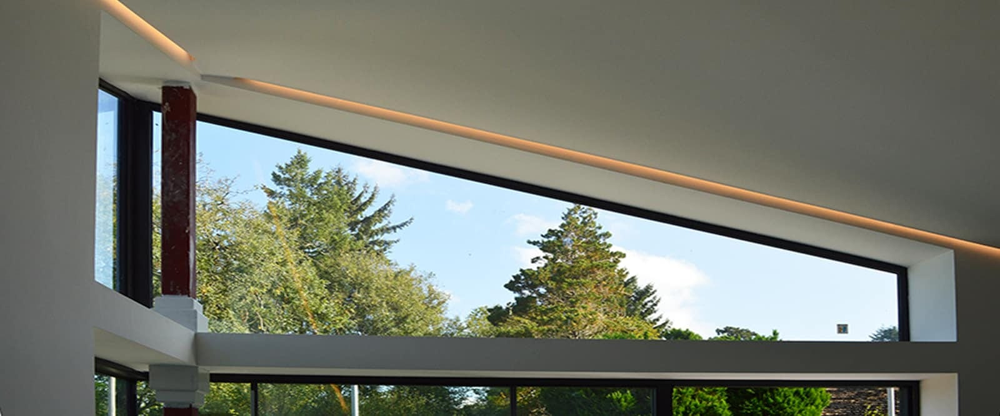
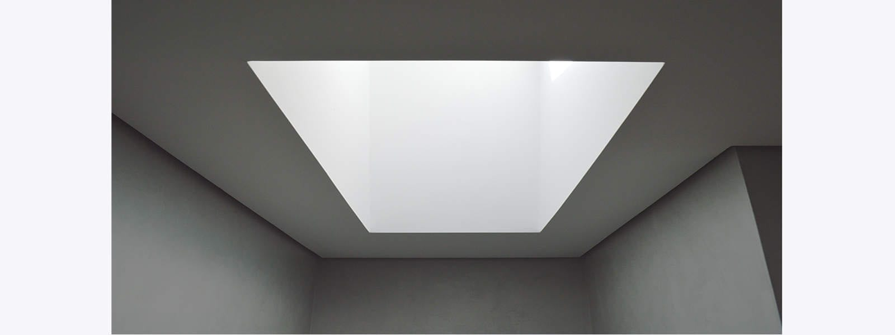

This is one of our projects which continued during lock down and is now nearing completion. A tired looking 1960s property has undergone a dramatic transformation with neighbours wondering whether this is indeed a new-build.

All existing brickwork walls have been rendered, with the new extension forming a blue-grey brick counterpart under a unifying zinc roof. The interior will be a modernest white with an open-plan plywood kitchen and dining area. The new living space steps down for a level terrace access with corner glazing and a feature stove, yet to be installed. 

The new master bedroom suite features a polished plaster bathroom with ambient LED lighting in perimeter shadow gaps. The new bedroom is orientated towards far-reaching views with a full height corner glazed screen accessing the roof terrace. Ample daylight and beautiful views have assisted to creation of these dramatic new spaces. 

contractor

[Corner Construction](http://cornerconstruction.co.uk/)

structural engineer

[Marbas](https://www.marbas.co.uk/)

