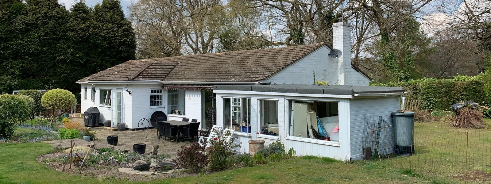

Waverley BC has granted planning for our design to remodel and extend a 1960s bungalow in Haslemere, Surrey.

Our design uses Passivhaus principles to improve the energy efficiency of the home. The entire existing building envelope being upgraded with an insulated rain-screen render system and replacement glazing throughout.

The new first floor extension will be a SIPs construction, covering the entire footprint with a high performance first floor and a chalet roof. Renewable energy in the form of integrated photovoltaics will complete the transformation.

The interior remodelling will provide a double-height entrance hall with feature staircase and a new open plan kitchen and family room. Three new bedrooms with bathrooms and ensuite will be located off a dual aspect gallery space on the first floor.

​

