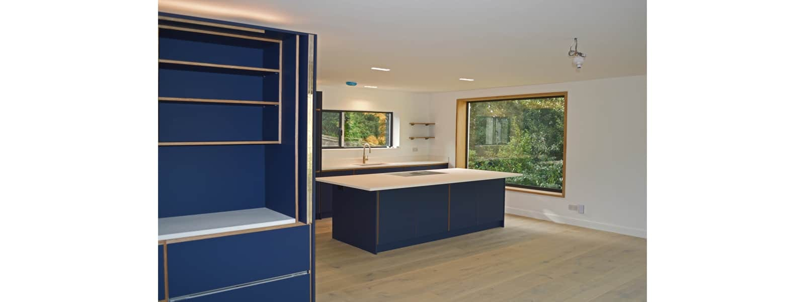
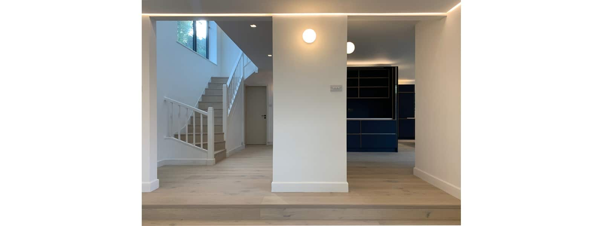
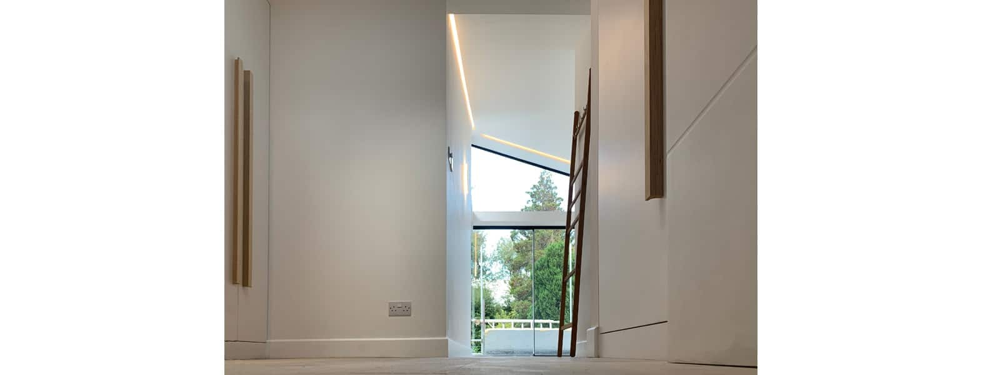
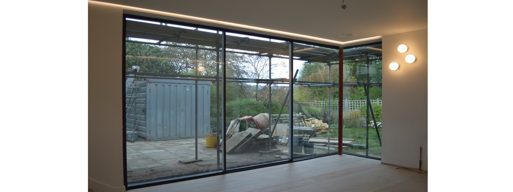
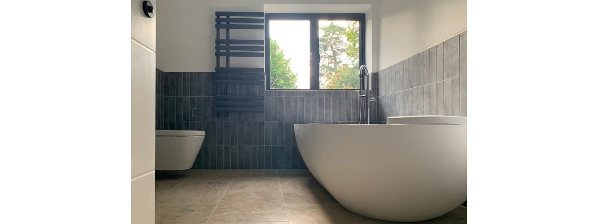
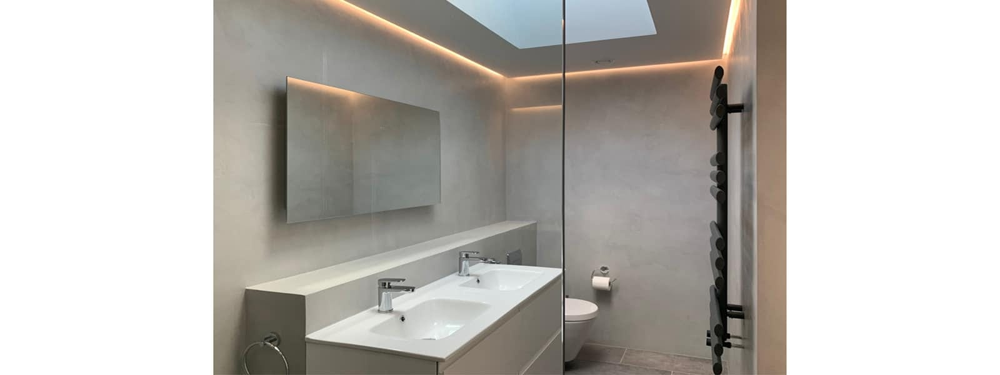
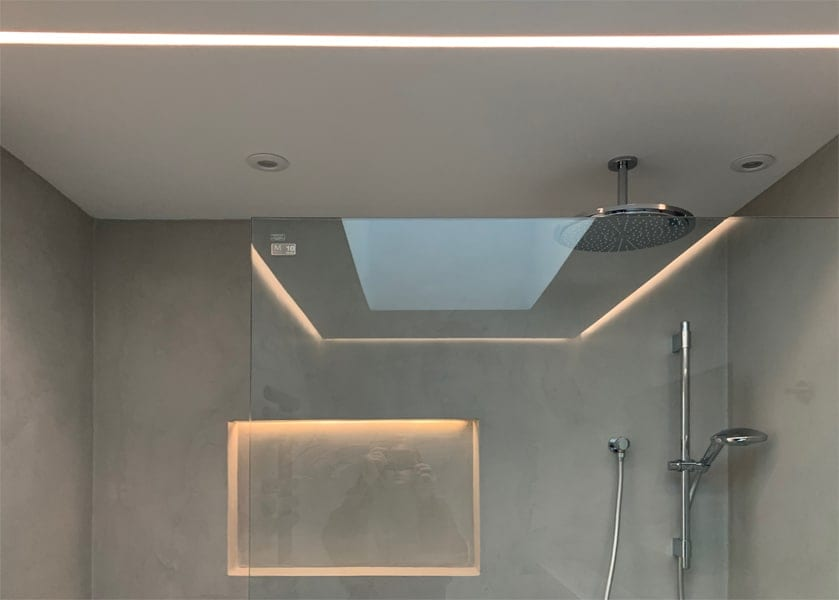
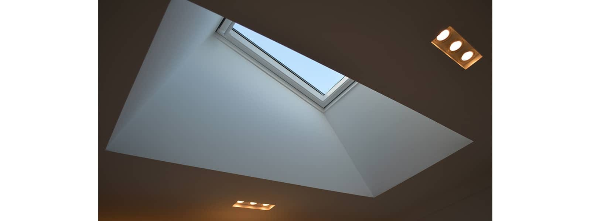

The interior fit-out is now complete with stunning views across the entire house. The new lighting concept with LED-roped ambient lighting and ceiling and wall task lights provides a transformative yet calm atmosphere across the whole family home.

The distinctive plywood kitchen with a new picture window opens up views and frames to the soon-to-be implemented soft landscaping.

The new master bedroom suite opens up to Haslemere's stunning autumnal views with corner glazing under the vaulted ceiling. The frameless balustrade is due to be installed next.

