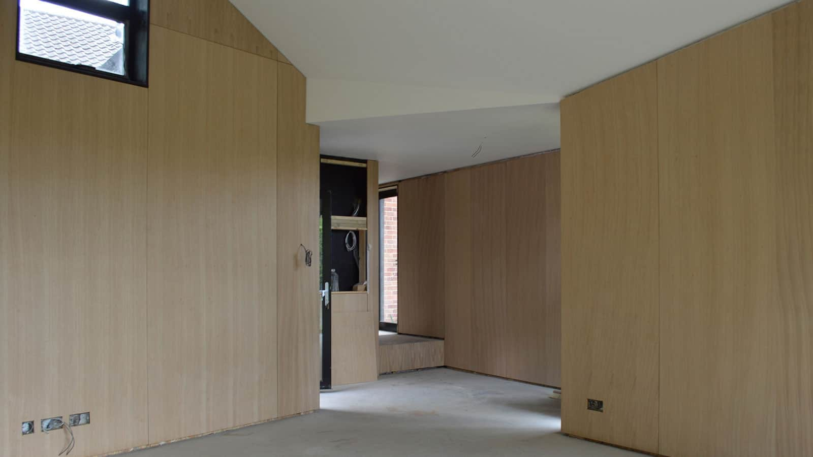

Oak veneer paneling has been installed at the near-Passivhaus annex as this project enters the final stage of the build. The marmoleum flooring with shadow gap skirting detail is next. The polished plaster in the shower room is complete and second fix electrics and plumbing are on-going.

