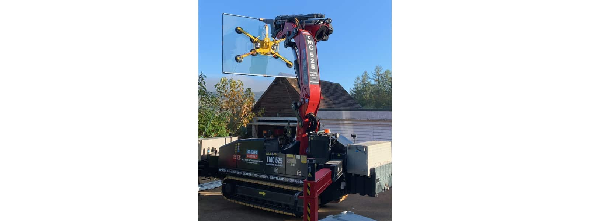

Delighted that the BIG glazing is now being installed at our project in Dorking, Surrey. The structural roof light by [Glazing Vision](https://www.glazingvision.co.uk/) and the double slider by [Kloeber](https://www.kloeber.co.uk/), were both craned in yesterday.

This extensive renovation and extension of an arts & crafts family home is nearing completion with internal finishes due by the end of the month.

To read more about this project, click [here](https://www.architecturelive.co.uk/2021/06/a-room-with-a-view-dorking-surrey/).

