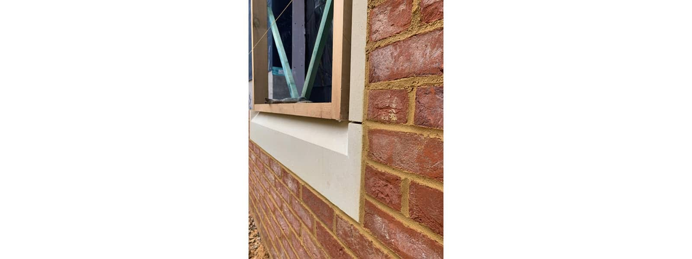
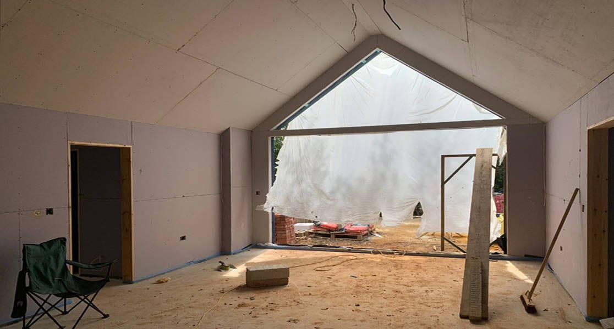

Substantial progress has been made with the construction of our new build retirement annex near Chiddingfold, Surrey.

Exterior brick work and reconstituted stone window surrounds are being constructed, whilst composite windows are due to be installed next week. For the interior, final decisions are being made on finishes.

contractor

[Brickfield Construction](https://brickfieldconstruction.co.uk)

structural engineer

[Design4Structures](http://www.design4structures.com/)

