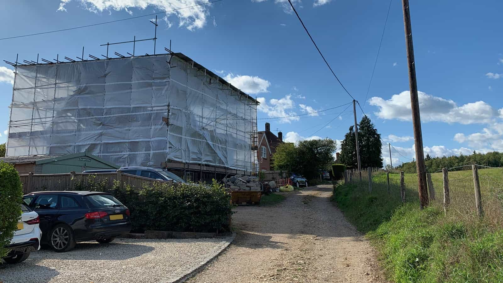
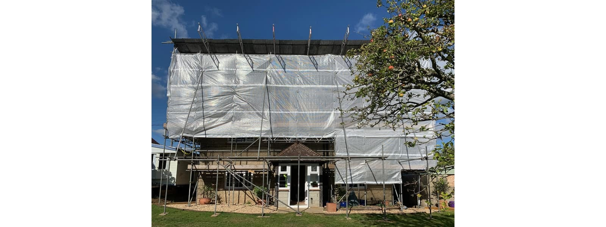
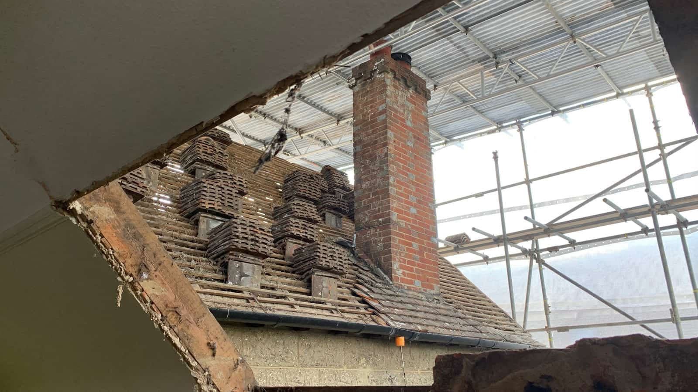
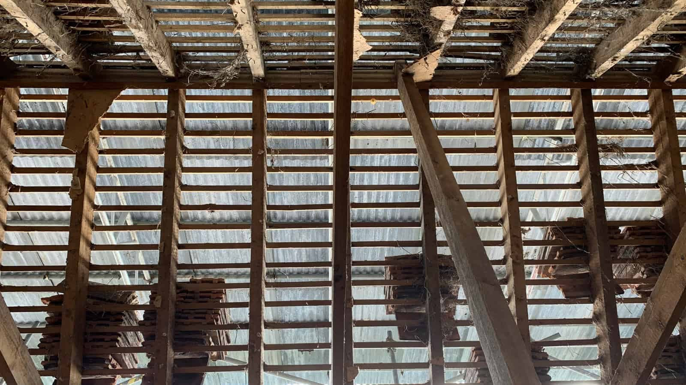

This cottage in the picturesque village of Stedham in the SDNP was originally entirely surrounded by heathland.

More than half a century later, its original building approach and orientation are out of context with well aged building facilities and services. Our clients have therefore taken on this labour of love to update and extend this cottage.

Following planning permission for our design in 2019, the construction work has now commenced with a large tin hat protecting the existing historic structure and ensuring optimum working conditions for the wetter and colder seasons ahead.

​

