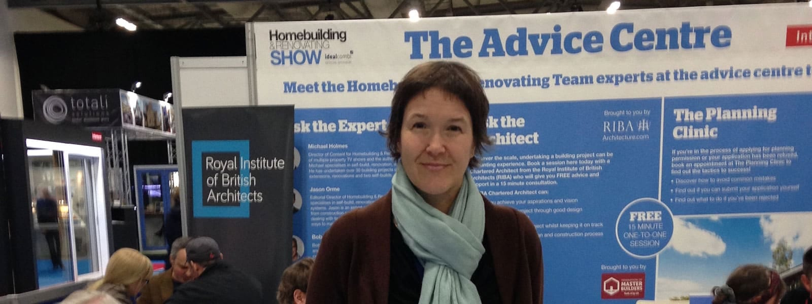

Irene Konschill took part in the first Homebuilding & Renovating Show to be held at Farnborough International on Saturday.  Volunteering for the Royal Institute of British Architects (RIBA) as an expert in the 'Ask an Architect' section, Irene was delighted to answer questions and give advice to the back-to-back enquiries relating to site viability and developments, showing that the UK self build market seems to be as buoyant as ever.

