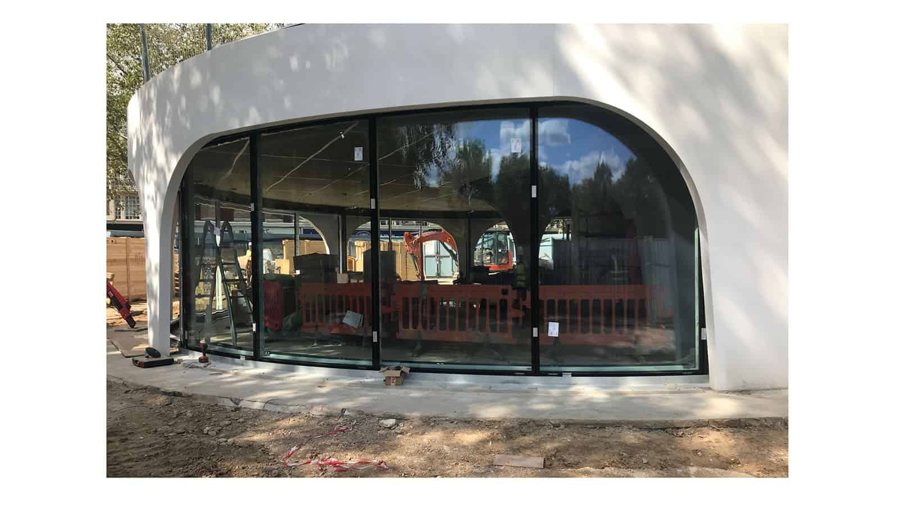

We are delighted to share a new video clip demonstrating the [Descender Fronts](http://www.kollegger.net/) recently installed at the Duke of York Restaurant in London.

Located on Kings Road, the restaurant will be the new centre piece of the Duke of York Square, home to retail shops, boutiques and the renowned Saatchi Gallery. The restaurant, an award winning spiral design by [Nex—](http://www.nex-architecture.com/projects/duke-york-restaurant/), features a large, curved, double glazed facade. Three 9 metre-long elements of the facade will fully descend into the basement allowing the restaurant to benefit

