This is what we do.

Continuing professional development or simply life-long learning is intrinsic to architecture and you may hear the occasional grumble from an architect about the latest legislative changes that have to be incorporated into an ever-growing framework of rules and regulations. But this is what we do.

On a much more fundamental level however, architecture, as a creative discipline, requires the continuous development of ideas and design concepts. Technological advances as well as changes in regulations are only a trigger for a constantly evolving design response.

Ever since discovering [James Turrell](https://jamesturrell.com/work/type/) in our studies we have been fascinated by the quality of light as an element of design. Turrell, an American artist working with light, pioneered the use of light as a tool to influence the human perception of space at a time when LEDs were yet to become commercially available.

Since then much has changed. The last decade alone has seen vast advances in luminaries and has made the seamless integration and implementation of light much more feasible and cost effective. We therefore consider the design of light to be a fundamental part of our holistic approach. A flurry of spotlights indiscriminately scattered across the ceiling is a crude and outdated means to an end. Natural light, throughout the day and across the seasons, as well as artificial lighting are the key stimuli to experience space visually. So this is what we design too.   

​

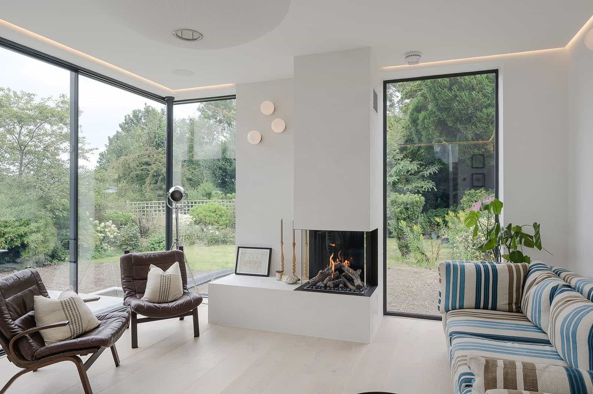

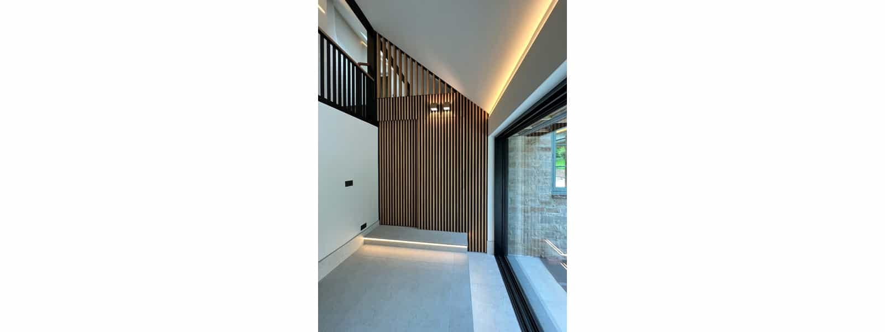

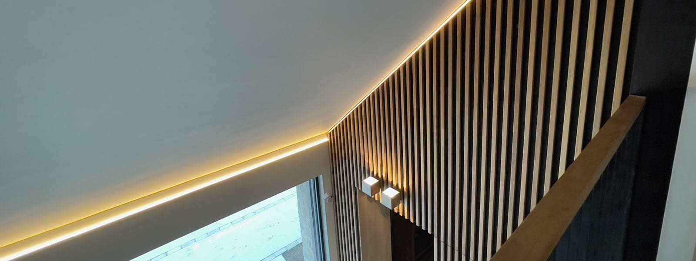

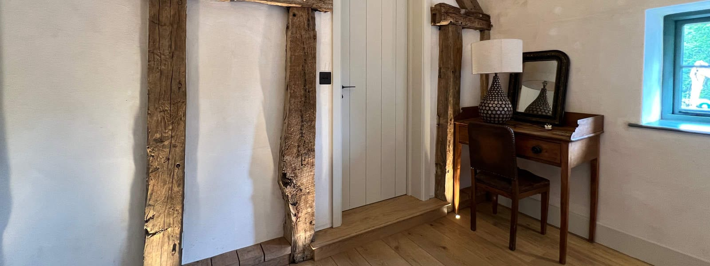

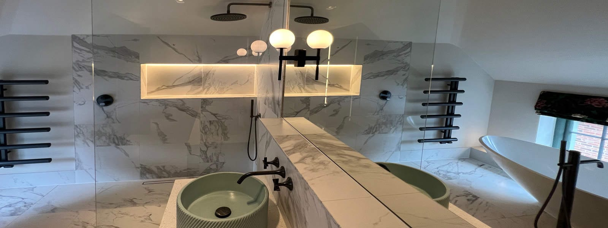

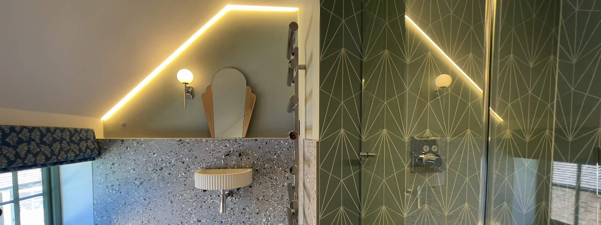

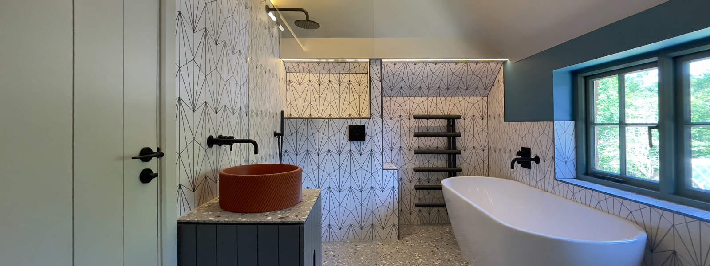

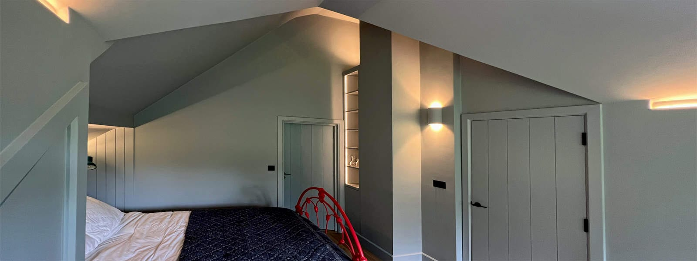

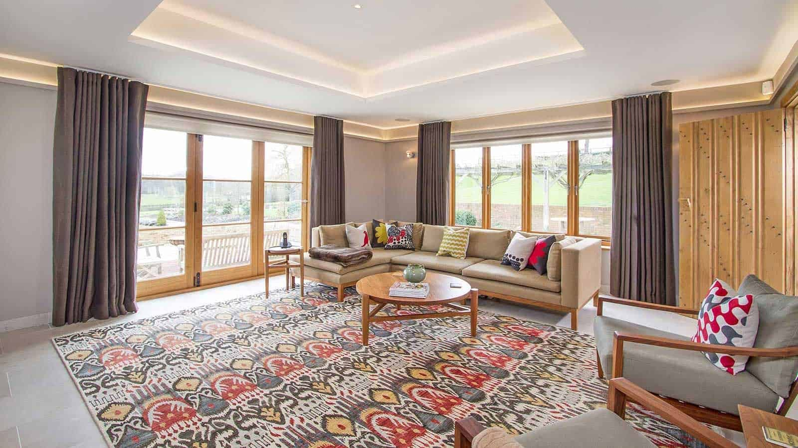

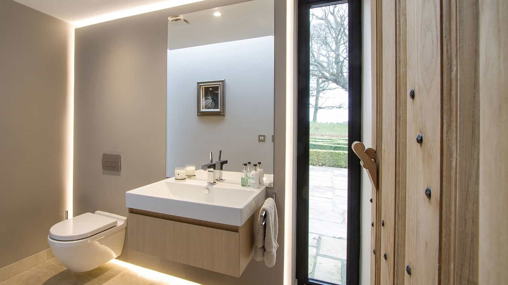

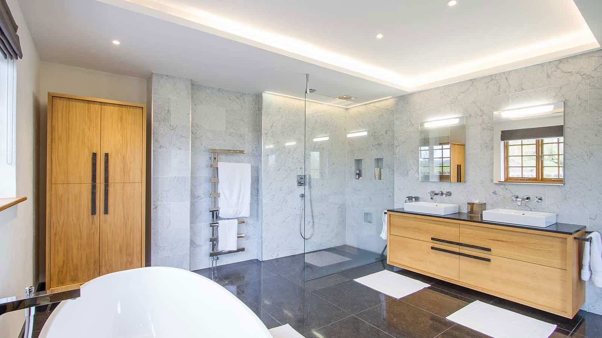

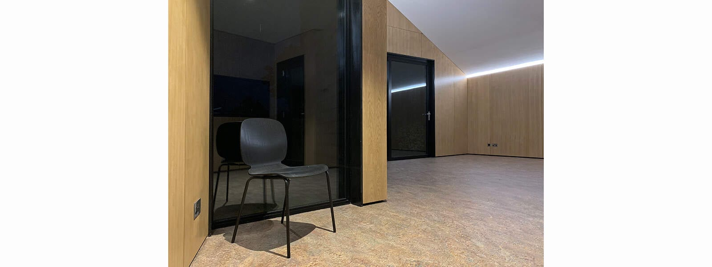

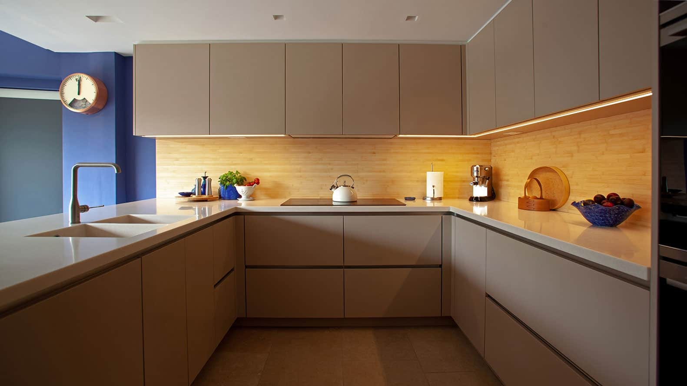
