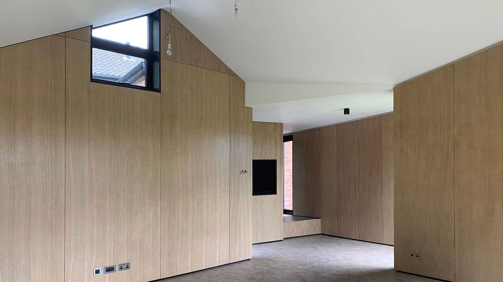
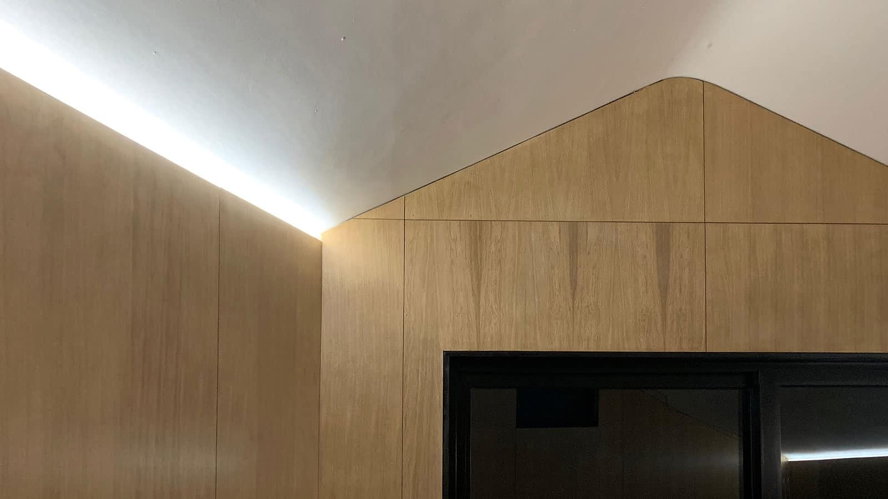
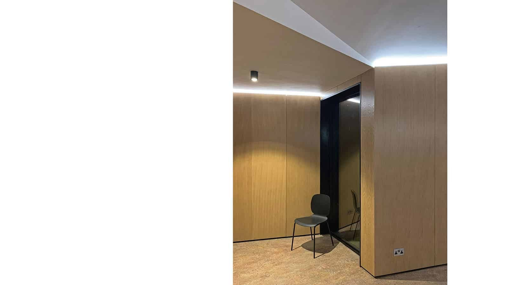

We are thrilled that one of our projects, the remodelling and extension of a 1960s detached home in Lodsworth has been featured in the December edition of the magazine - 25 Beautiful Homes. Dressed for the Christmas, our client’s home looks beautiful as ever.

To read more about the project, click [here](https://www.architecturelive.co.uk/projects/near-passivhaus-office-extension/).

