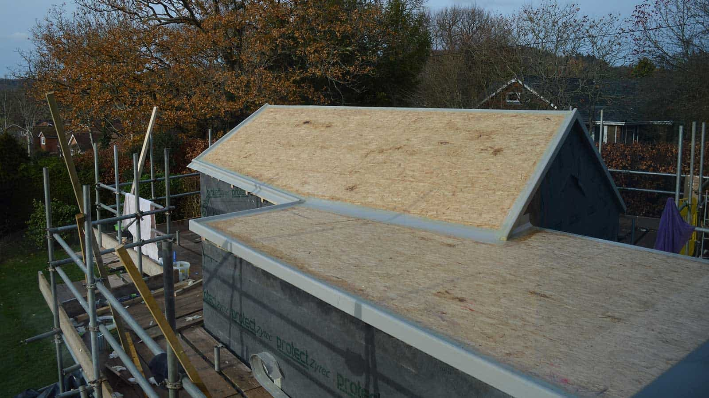
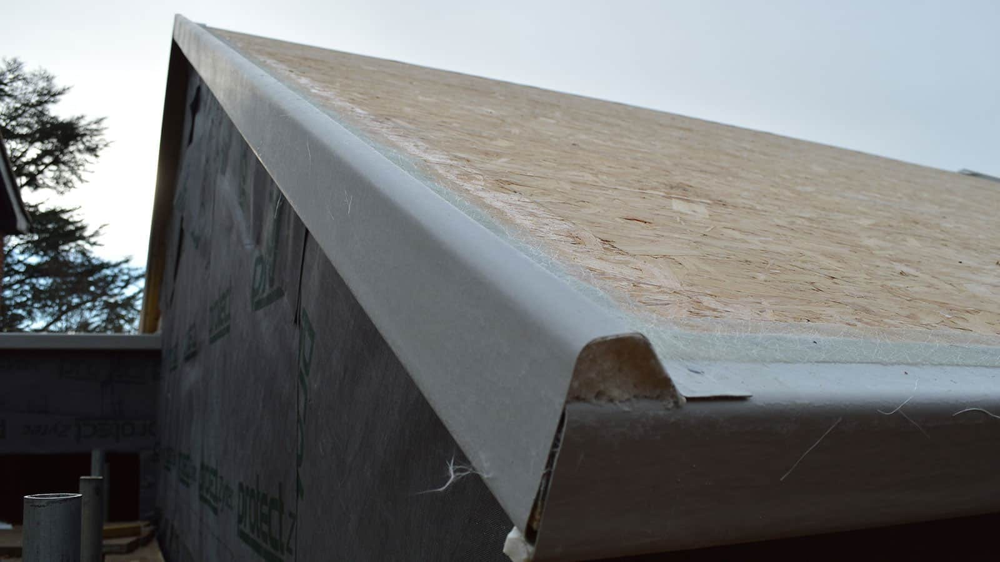

[Birchland Homes & Construction](https://www.birchlandhomes.co.uk/) have now taken over from Bentley SIPs and arrived on-site yesterday. With the waterproofing of the roof now well underway, the facias and trims are nearly complete. The first coat of resin is being applied today and the top coat will follow when the weather is obliging.

