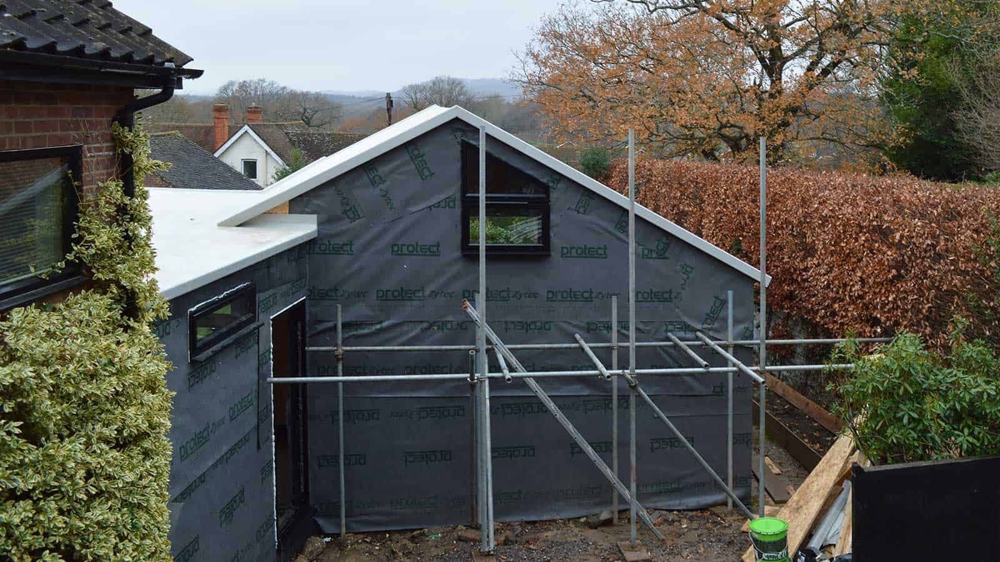

The windows are in!

All openings have been fitted with polyester powder coated windows or doors. The annex is, therefore, watertight and ready for the internal fit-out. This project also had a visit from Building Control, Salus, today. 

One of the benefits of using SIPs at this time of the year was that despite the unreliable and very wet weather, the superstructure could be erected at such speed - just over 2 weeks - that it remained dry throughout, eliminating the need for any drying-out.

