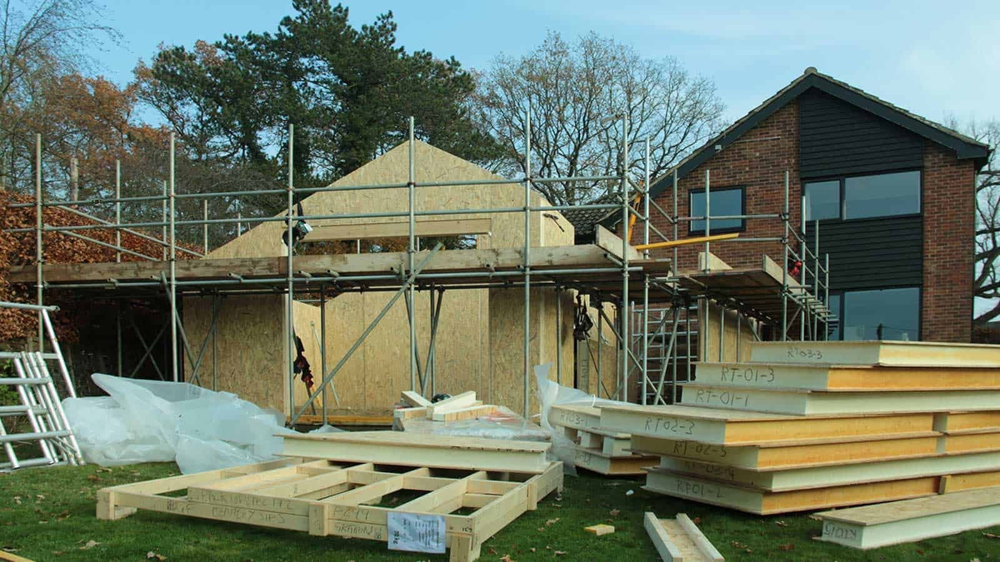
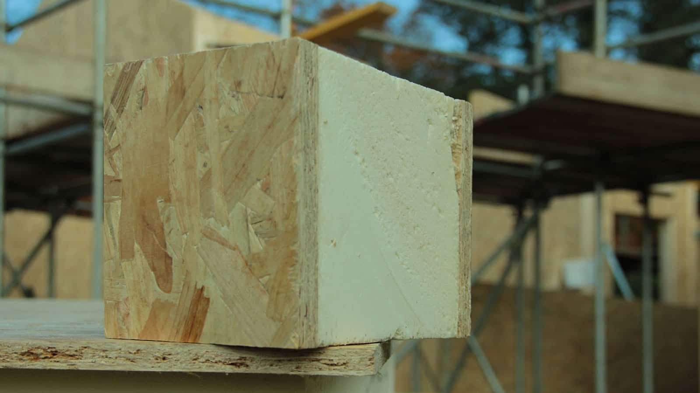

Progress on-site is really impressive with all the wall panels now installed. The annex interior feels very spacious and the volume can now clearly be read in relation to the existing building. The flat roof is being installed at the moment and the vaulted ceiling/ pitched roof is next.

Kingspan’s Structural Insulated Panels are made up of rigid polyurethane insulation sandwiched between two sheets of Oriented Strand Boards (OSB). Each panel is manufactured in the factory to the exact design required for each project. SIPs are one of the most airtight and highly insulated building systems on the market, which allow for the construction of environmentally sustainable buildings with excellent energy efficiency ratings.

​

