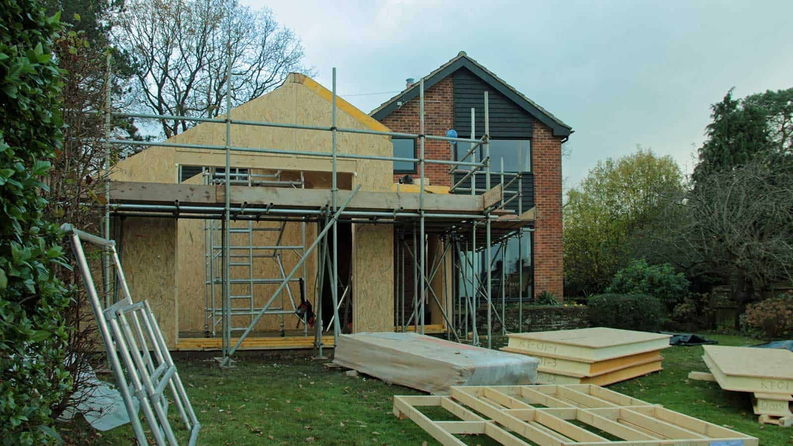
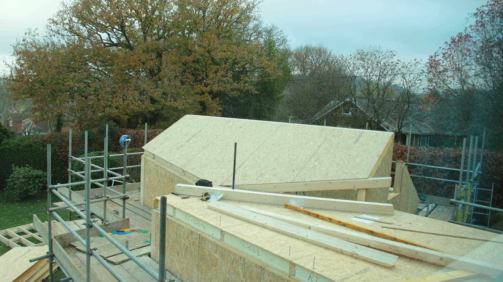

The steel ridge beam was already lifted into place yesterday and now the final pitched roof panels are being installed with the roof nearly completed. Rain is forecast for the weekend, so the crew will fit a temporary cover before the end of the day. We love the space!

