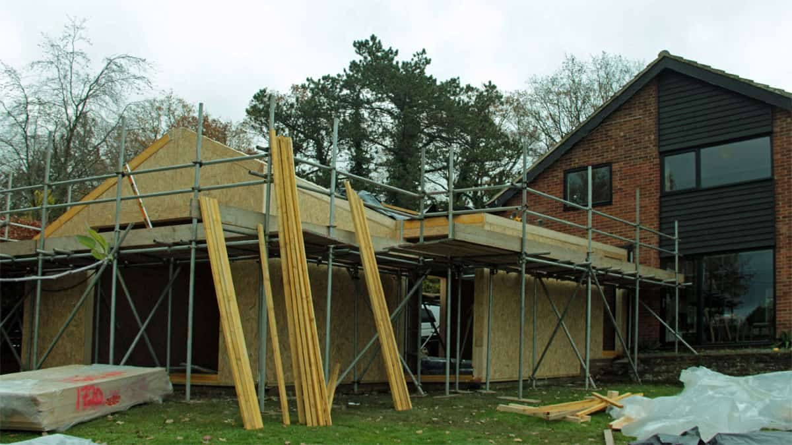
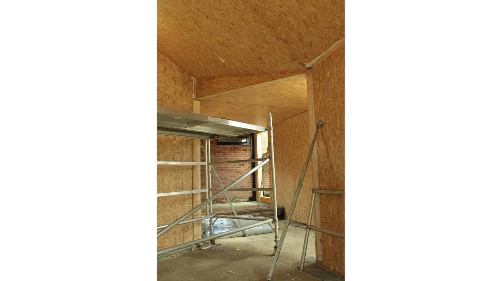
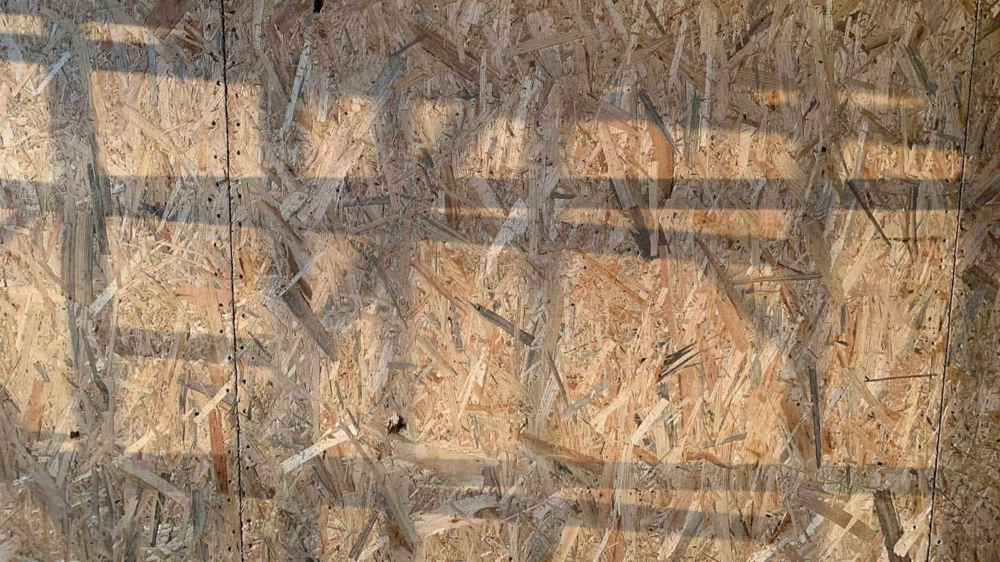

Rain over the weekend was not too bad and the building shell stayed largely dry. With the building super structure now in place, final trims are being installed ahead of the building being wrapped in breather membrane. Bentley SIPs will also install the roof battens and deck and internal stud walls, for which the materials are already on-site.

