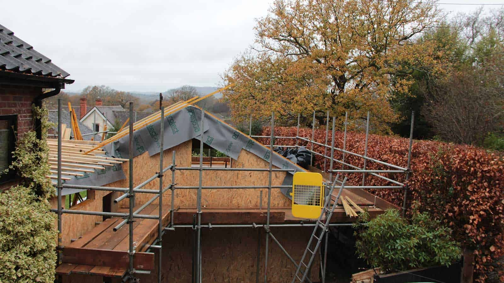
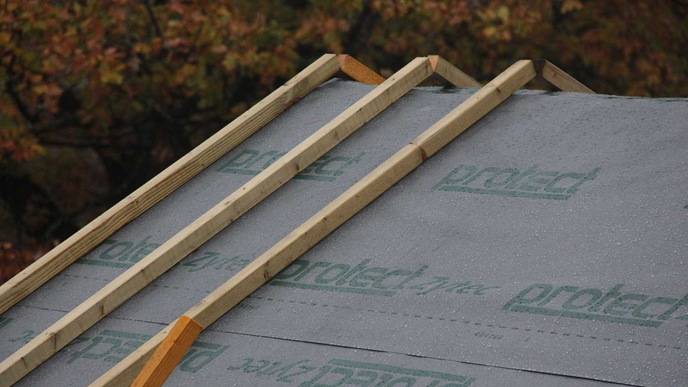
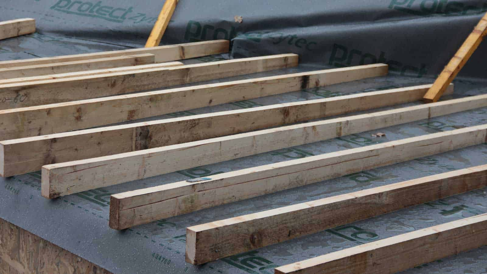

Heavy rain is hampering progress as the roof boards, once installed, should remain totally dry before the final roof cover goes on. The battens will be completed today, but the boards may have to wait for the skies to clear. The waterproofing will be seamlessly applied to the pitched and flat roof and finished with an extensive green roof system.

