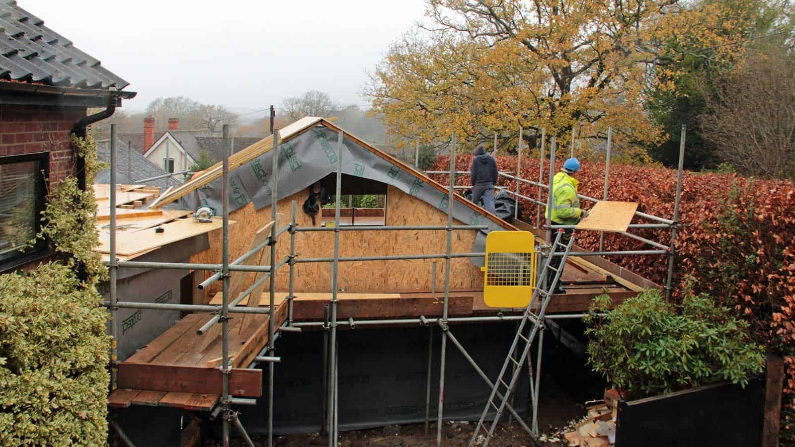
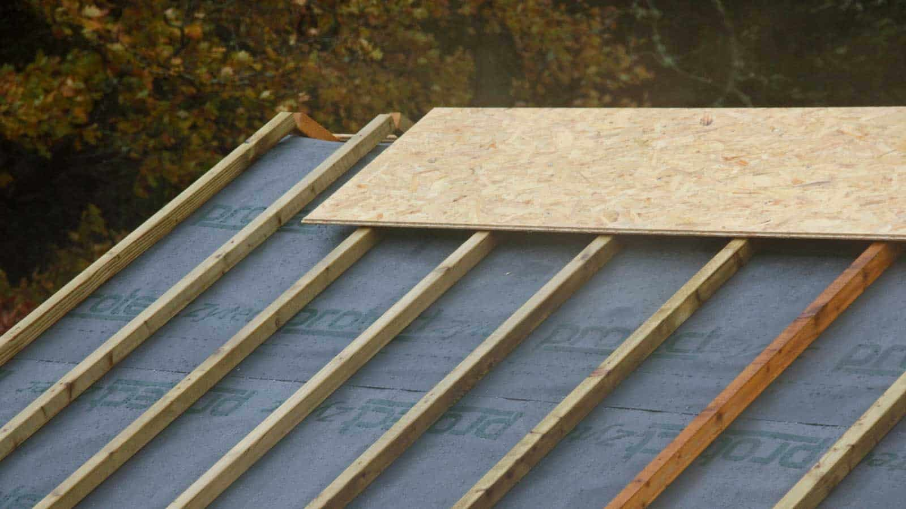

We had a change of plan, given the persistent lousy weather forecast until Friday. The crew is now pressing ahead with the roof boards regardless, covering them up once installed as they go along. Hopefully, Friday will bring the badly needed dry weather for any damp patches to dry out and the waterproofing to be installed before the next weather front arrives!

