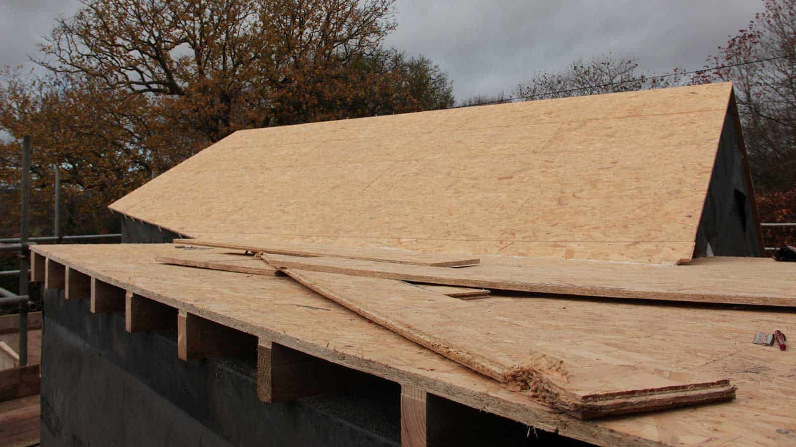
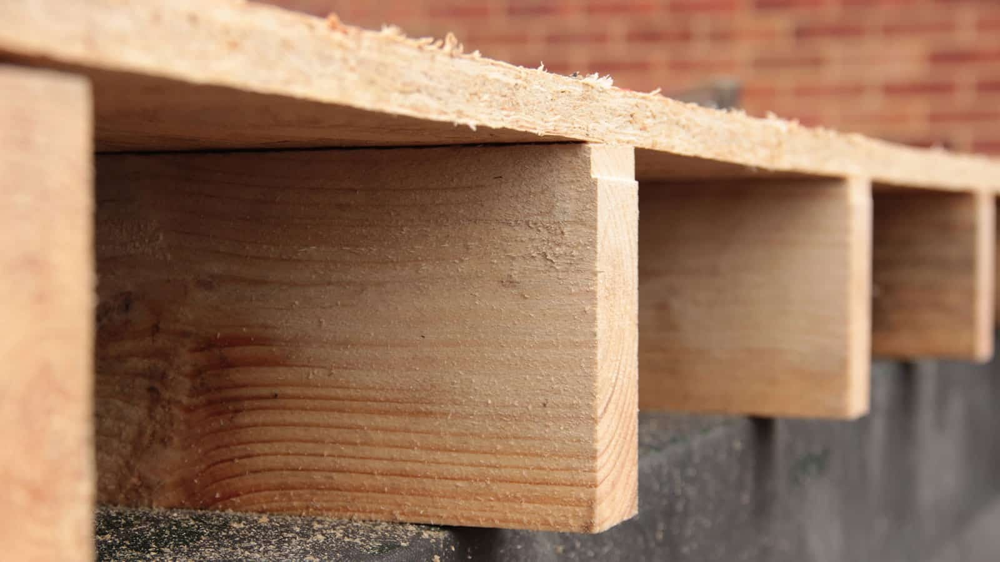

Despite battling against the wind and rain, the roof is finished! The interior stud wall frames are currently being put in place and that will then complete the construction of the super structure. The second phase of the project begins next week. The structure will be waterproofed and the glazing installed. The [Bentley SIPs](https://bentley-sips.com/) team have done a great job, keeping the site clean and tidy (despite the weather) and finishing ahead of time.

