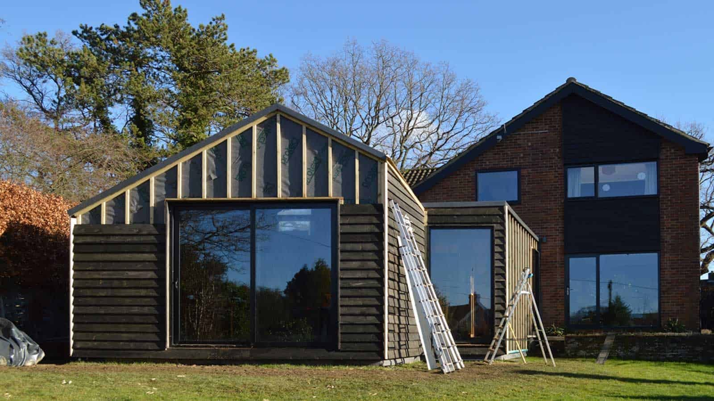

The stained Cedar cladding is currently being installed on the exterior of the near-Passivhaus annex whilst the first fix is imminent.

Interior design details have been finalised, bringing together elements of ply and marmoleum for the main space. Polished plaster, marble, and steel will be used for the new shower-room to create a natural, yet striking look.

