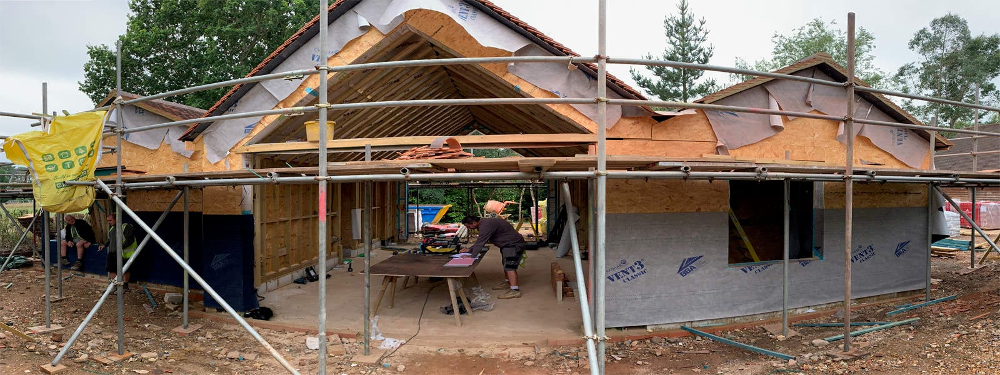
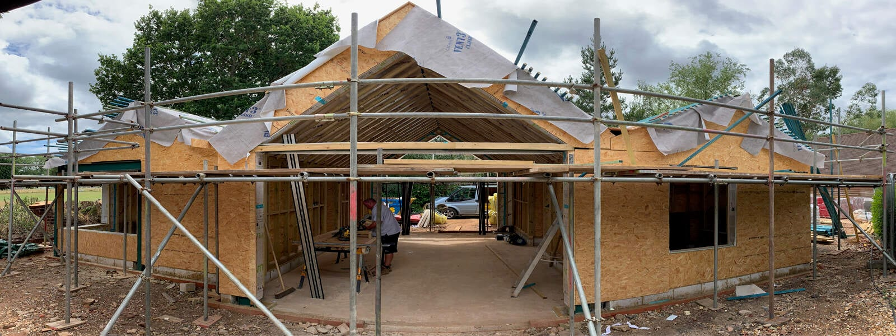
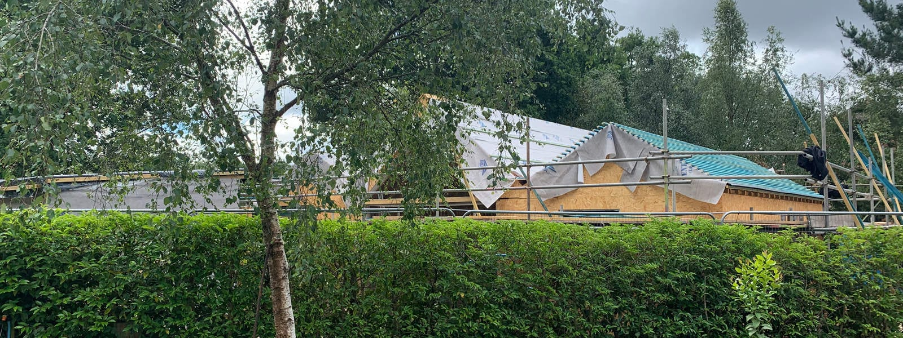
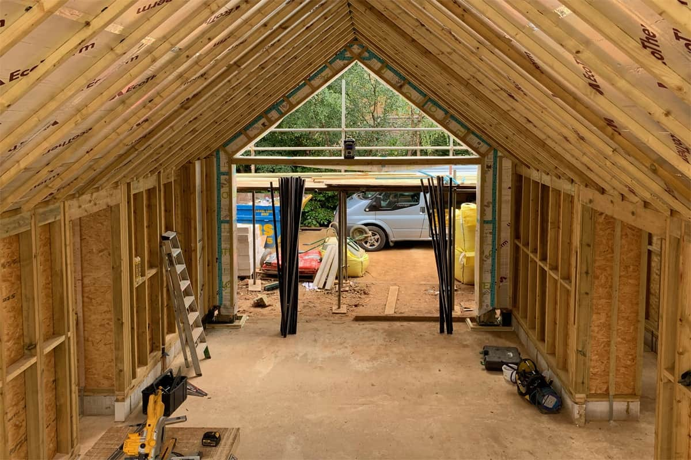

The near Passivhaus timber-frame construction is now completed as is the fully tiled triple roof, for our new build retirement home near Chiddingfold, Surrey.

First fix electrics are currently on the go and the reconstituted stone window surrounds will be cast next week by Masoncast Ltd, based near Milland. The weather has assisted the good progress and we are fast approaching the exciting phase of interior fit-out.

​

contractor

[Brickfield Construction](http://brickfieldconstruction.co.uk/)

structual engineer

[Design4Structures](https://www.design4structures.com/)

