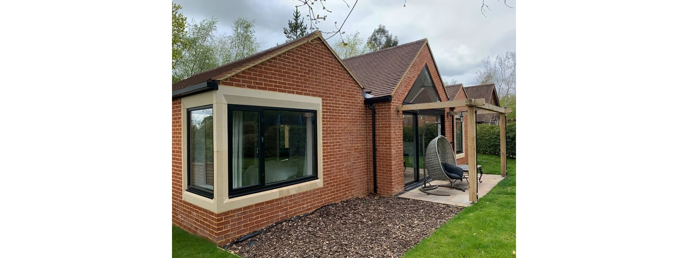
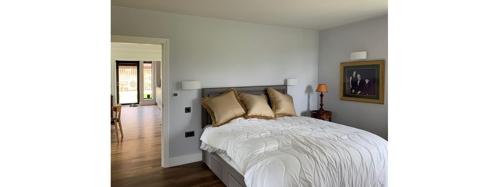
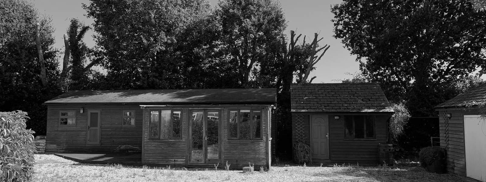

This new retirement home has now been occupied for half a year and its owner is enjoying the new bright and airy living accommodation with double aspect views.

This is our latest example for intergenerational living, with a family of four having bought this property on a large plot with the view to accommodate their retired family member. Two years later, the family was able to be reunited in record time and just before the last lock-down, with building works proceeding throughout the Pandemic in order to deliver the new home.

The annex has been designed to be sympathetic to the existing property, with clay tiling, brickwork and stone surrounds being reinterpreted for the new home.

As its new occupant downsized from a very large property abroad, internal spaces were designed to flow into each other, with double aspect views and daylight all through the day. The new master bedroom has been orientated towards an adjacent field with a generous corner window framing the morning sun.

The garden design, in part yet to be realised, includes pergolas for undercover outdoor seating and raised sensory flower beds, all fully accessible. However, even in its first spring bloom, the far-reaching views across the neighbouring fields and the adjacent garden already provide a beautiful setting.

​

