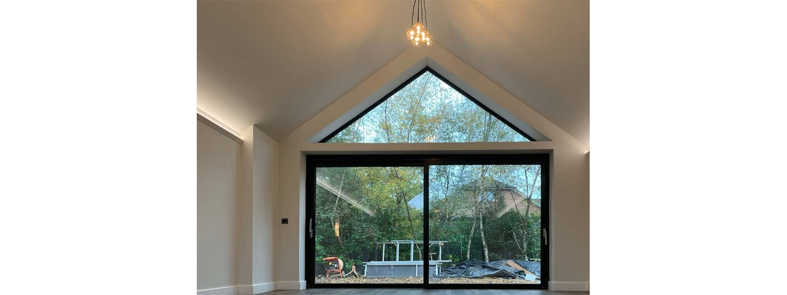
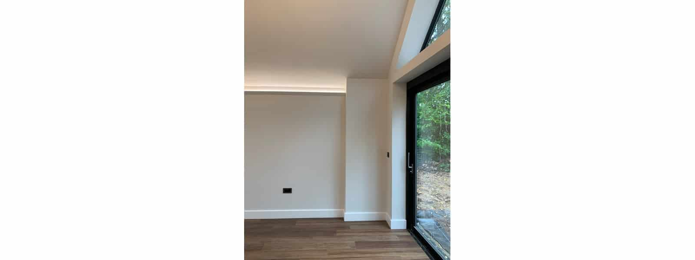
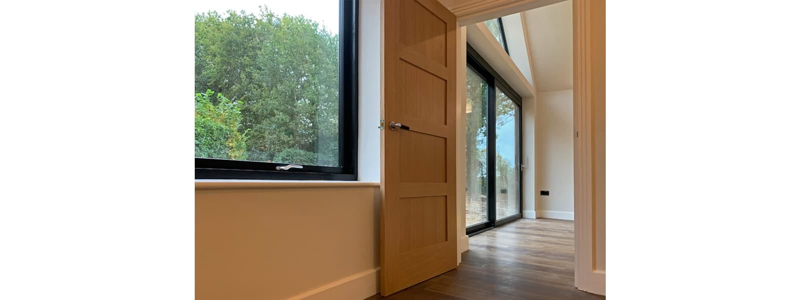
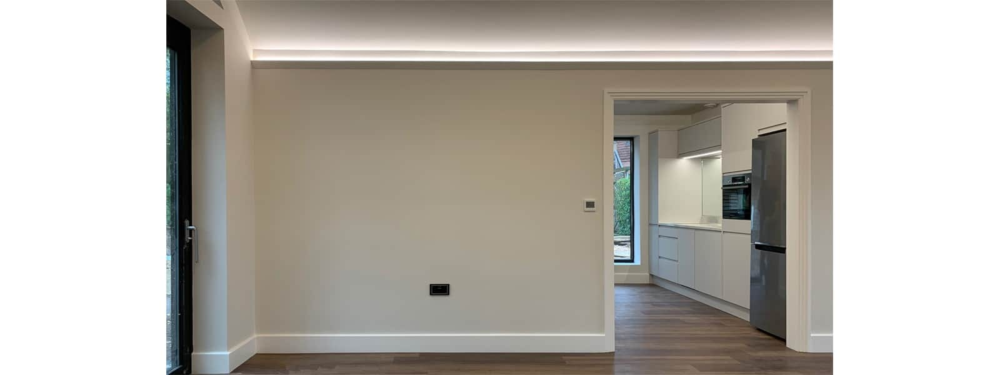
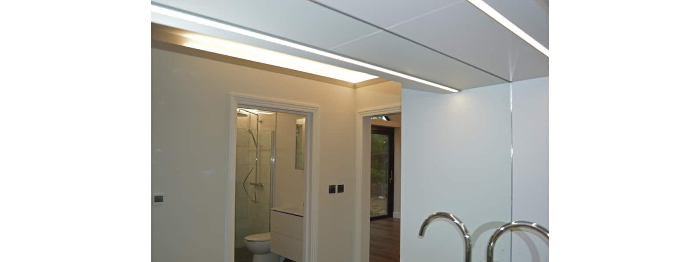
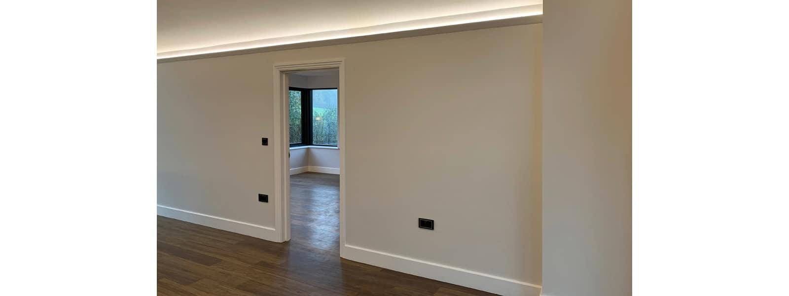
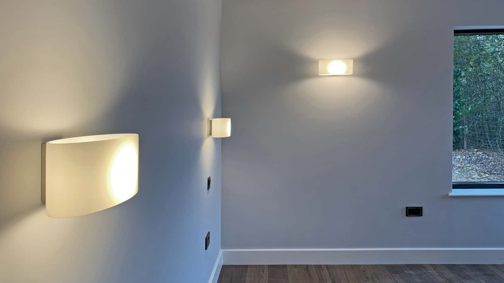
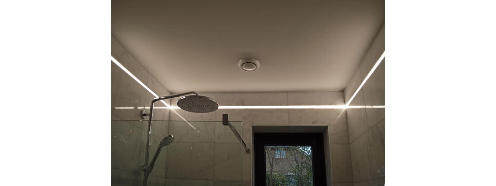
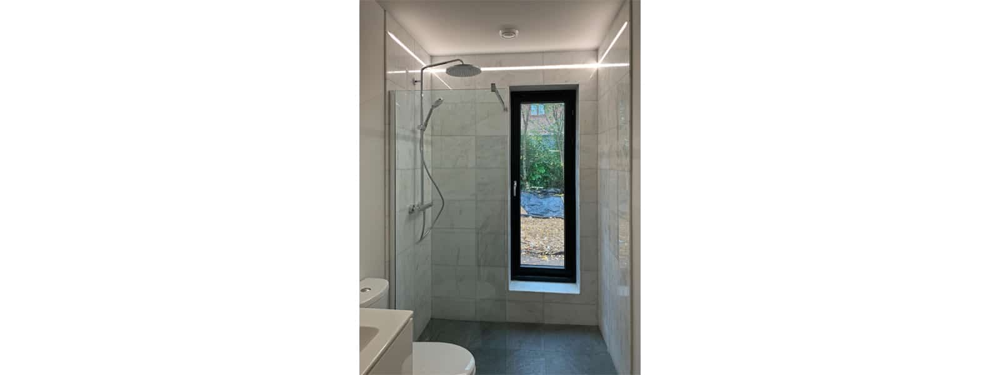

We are delighted with the completion of this new-build retirement annex. External works are yet to be completed but the new home is ready for occupation.

This two-bedroomed property layout has been designed to be fully wheelchair accessible, robust and flooded with natural light throughout. The external works will deliver two covered terraces with flush thresholds and timber pergolas for sun-shading and rain cover to enjoy the outdoors. 

The two north-south orientated glazed gables form a spacious, dual aspect and naturally lit principle living space. The master bedroom suite with corner window to take in the meadow views as well as the secondary bedroom, boot-room, additional wet room and kitchenette are all accessed off this central space. All views will take in the new hard and soft landscaping as well as the grazing meadows beyond.

This project has been constructed with a thermal performance and airtightness nearing Passivhaus. An air source heat pump, ASHP in combination with underfloor heating delivers the minimal required additional heat throughout.

This is a great example of inclusive design reuniting a family of multiple generations for their future.

