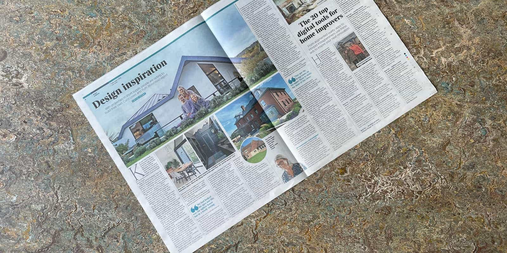
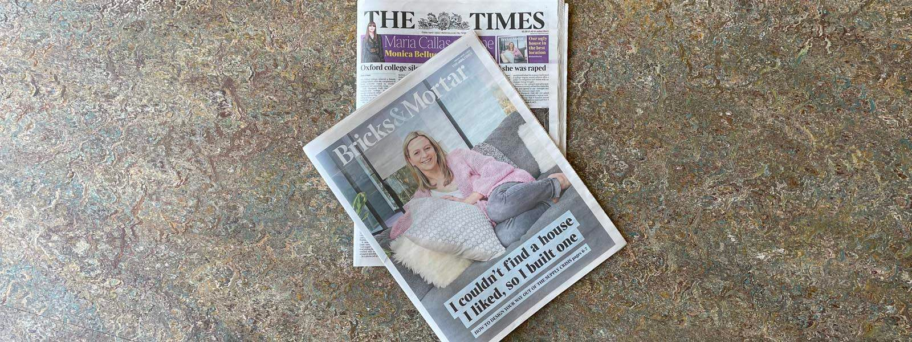

We are delighted that the remodelling and extension of our 1960s bungalow project in Haslemere, Surrey has been featured in the Bricks & Mortar supplement of The Times newspaper today.

Our design created a new, contemporary, first floor accommodation across the entire bungalow footprint with a new holistic design. The reconfiguration of the existing ground floor also allowed for the relocation of all principle living spaces on to the top floor as an upside-down house layout in order to benefit from a southerly garden aspect.

Based on Passivhaus retrofit principles, our project specific low-energy design provided a SIPs first floor superstructure as well as building envelope upgrades throughout in addition to a new Air Source Heat Pump.

To read more about the project, click [here](https://www.architecturelive.co.uk/projects/1960s-bungalow-haslemere-surrey/).

