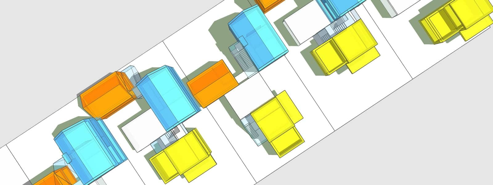

In these times of crisis, the way we live has suddenly become a central focal point. Our homes are our safe space as well as our confinement. The news from the care home sector may just feel like the latest story line, but sooner or later it will affect us all. And our feeling of isolation may have been compounded by the lack of access to our loved ones.

Over the last decades, the rising number of over 25s - 34s still living with their parents has been well documented. Coronavirus now puts a spotlight on our older generation’s fate. Are they still living (alone) in their own homes? And adults, living on their own now find themselves experiencing isolation paired with financial difficulties.

From a sustainability, but also resilience point of view, how families are configured has once again moved to the forefront of our survival with the primordial concept of intergenerational living offering a plausible solution, supported by Abraham Maslow's theories.

Our proposition is therefore to replace the two-up two-down, one of Britain's quintessential home typologies, with a model for intergenerational living, addressing the different requirements we will all face as humans in our lifetime in the context of global crises.

This is achieved through adaptable core-building blocks with multiple circulation routes that become the means of different reconfigurations to repurpose over time.

The resulting model is a resilient, intergenerational core community with:

-   an intrinsic social support networking for the young, elderly and sick
-   educational role models, supervision and support
-   integrated work facilities to enable the economic efficiency and reduce the reliance on transport to get to work and childcare
-   optimum use of the available building stock due to the flexibility to repurpose over time
-   shared infrastructure to reduce and optimise the demands, such as on site renewable energy generation, electric car sharing, social meals and shopping for reducing waste, shared external amenities with optional food production, …
-   the potential to reverse the trend of societal fragmentation

Core Building Blocks

1 - parents with children from birth to middle childhood

open-plan living with centralised kitchen and utility block,

two bedrooms with family bathroom and master-bedroom suite on top floor

2 - live/work unit

open plan work space with shower room and first floor one bedroom unit/bedsit

3 - later adulthood living

fully accessible facilities with kitchenette & living area and covered outdoor seating, ground floor bedroom & en-suite and first floor visitor/carer bedroom with en-suite

4 - shared facilities

living & dining, teaching, fitness, green roof terrace and gardens, car sharing and parking

