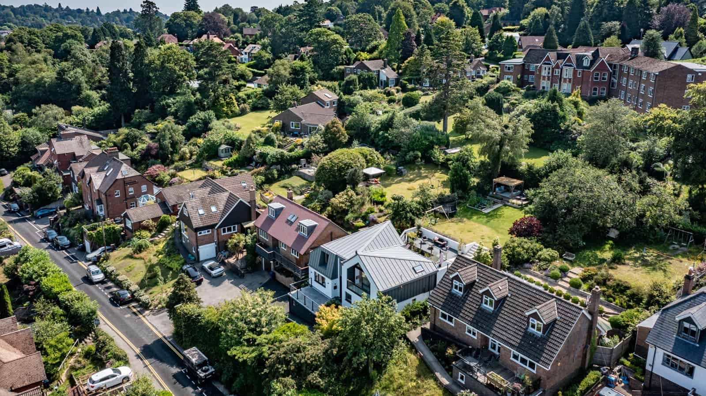

The People’s Choice vote for this year’s design award is now open. 

Last week, we were delighted to welcome the judges & team at our shortlisted project - #7 [Bungalow Conversion in Haslemere](https://www.architecturelive.co.uk/projects/1960s-bungalow-haslemere-surrey/). The winners of the 8 categories, including the people’s choice will be announced in February 2023. Our bungalow conversion into an upside-down house is shortlisted for New Buildings & Developments, Sustainable Design & Construction as well as the People’s Choice. 

Please take a moment and [vote](https://www.waverley.gov.uk/Services/Planning-and-building/Heritage-trees-and-design/Design/Design-Awards) for us if you agree that our team of visionary clients & architects, paired with highly skilled contractors has delivered an exciting transformation. Votes close on the 28th November 2022.

