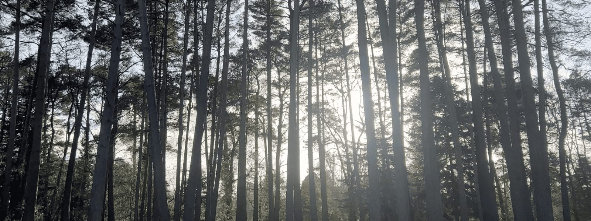
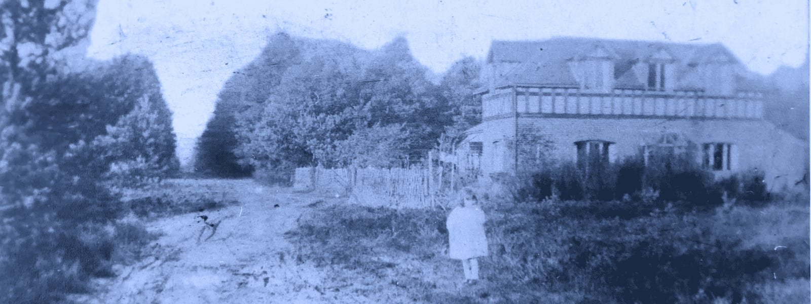
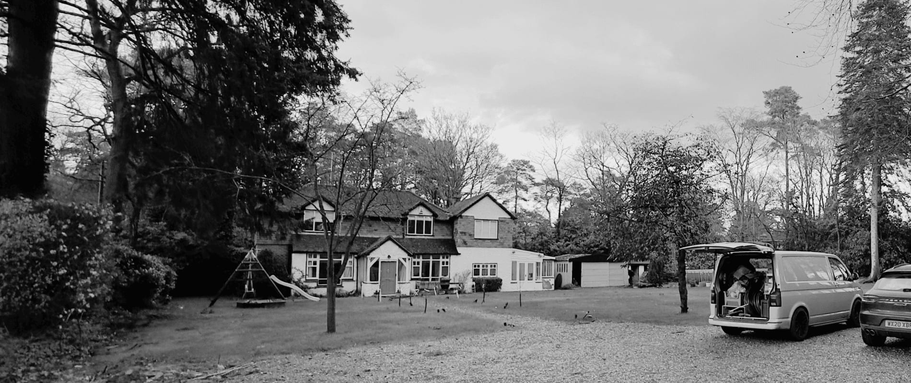
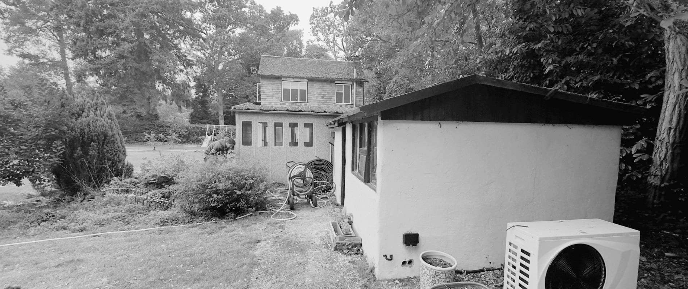
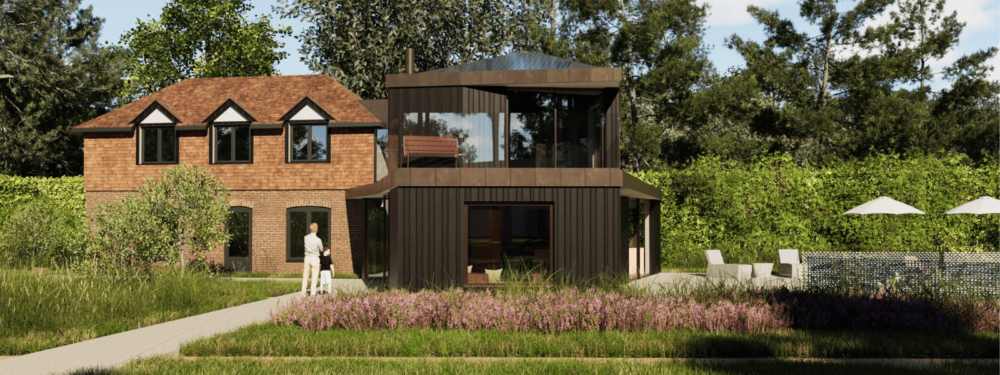
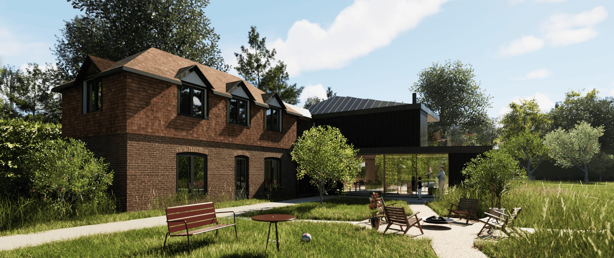

This planning application for the remodelling and extension of a Rushmoor property near Farnham has gained the planning officer’s support and is now due to be reviewed at the committee meeting.

The proposal has undergone stringent reviews by Waverley Borough Council already through the pre-app system and again by the planning team as well as the Surrey Wildlife Trust and the Surrey Hill’s National Landscape team. Further more, [Design South East](https://designsoutheast.org/) conducted a design panel review at the pre-app stage to provide independent expert advice which was supportive of the approach and design and provided some recommendations which were also implemented as part of the planning design.

Set within the Surrey Hills Area of Outstanding Natural Beauty and the Green Belt, this property was one of the very first mid 19C of what is known today as Rushmoor. Originally a modest, single storey thatched cottage, it was extended by a bold, two storey Victorian building to the south and later yet again in the mid 20th C by several smaller single and two storey extensions (most notably a gable) and outbuildings.

The formation of the site too changed over time, with the northern part of the land sold off in the mid 20C and the original thatched cottage demolished some time before then. What currently remains are the two storey Victorian extension, set in the north-western corner of the remaining site and the later additions and outbuildings aligned along the northern boundary. With the thatched cottage demolished, the original building approach and entrance were also lost. The property is now accessed from the opposite direction to the south and currently entered via one of the last extensions from the east. 

The key design principles are therefore the conservation of the existing Victorian building part including the partial reinstatement of its original form and features (within the limits of what is possible) and the improvement of the current building setting, its approach and entrance. The proposal also addresses the radically altered setting from heathland to woodland. A new extension takes on the north-south orientation of the thatched cottage origin and is located central within an existing clearing, whilst retaining a respectful connection to the Victorian building. This is made possible by repurposing the mid 20C gable extension as a link element between old and new.

The new extension is designed to be timber clad to blend with the pinewood setting with contemporary, full height glazing recessed into the facade or hooded by overhangs and canopies. The removal of windows, a roof light and a large perspex roof further improving the privacy and setting also for its neighbours.

The new extension facilitate contemporary family living with an open plan ground floor layout opening to the west and east for natural daylight throughout the day and directional views towards the woodland half of the site. The proposed first floor accommodation is orientated towards the south with a small terrace facing the woodland.

### “The panel is supportive of the contemporary approach to the new extension, particularly given that the context and neighbouring properties do not follow a set architectural style or design approach. The landscape of the extensive garden is key to this proposal, and the journey through the site should be considered at a strategic level. We commend the applicant team for bringing the proposal forward for design review, and given the sensitive context of the site, we have welcomed the opportunity to review the scheme .. to ensure a well-rounded proposal for planning submission.”

### _– Design South East  
_

