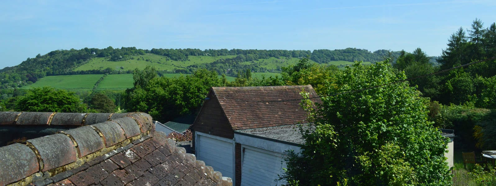

Planning has been granted in record time by Mole Valley Council for the extension and renovation of this vernacular style 1930s house into a 5-bedroomed contemporary family home.

The existing property features generous room sizes and stunning views from the rear garden onto the Surrey Hills. The new extensions and reconfigurations will, in part, reorientate the existing interior layout by providing open-plan, dual aspect living as well as a suspended first floor master bedroom suite, all benefitting from the stunning views.

The ground floor extensions will use matching brick and new brick on edge parapets to refer to the existing arts & craft details. The new cantilevered tile-hung gable extension will be executed with hidden gutters and down pipes to add a new contemporary aspect to the design, which will be complimented by a new structurally glazed entrance atrium cut into the existing cat-slide roof.

